# Annadaan (अन्नदान) - Food Donation Platform

> **"अन्नदान महादान - The Greatest Gift is Food"**

A full-stack web application connecting food donors with NGOs and volunteers to reduce food waste from Indian weddings, festivals, and events by redistributing surplus food to those in need.

[](https://nodejs.org/)
[](https://expressjs.com/)
[](https://www.mongodb.com/)
[](LICENSE)

---

## Table of Contents

- [Overview](#overview)
- [Problem Statement](#problem-statement)
- [Features](#features)
- [Technology Stack](#technology-stack)
- [System Architecture](#system-architecture)
- [Data Models](#data-models)
- [API Documentation](#api-documentation)
- [Getting Started](#getting-started)
- [Security Findings](#security-findings)
- [Screenshots](#screenshots)
- [Contributing](#contributing)
- [License](#license)

---

## Overview

**Annadaan** is a digital platform designed specifically for the Indian context to tackle food waste by creating a systematic bridge between:

- **Event Donors** (Wedding halls, temples, caterers, corporate events)
- **NGOs & Charitable Trusts** (Food distribution organizations)
- **Community Volunteers** (Delivery partners for food logistics)

The platform enables real-time food donation management, tracking, and impact analytics to ensure surplus food reaches those who need it most.

### Key Metrics Tracked
- Plates Served
- Food Saved (kg)
- Monetary Value (INR)
- People Fed
- Environmental Impact (Fuel Saved)

---

## Problem Statement

In India, weddings, festivals, and corporate events collectively generate **tons of edible food waste every day**. While hunger and food insecurity remain pressing issues, there is a **lack of systematic channels** for efficiently redirecting surplus food to those in need.

**Annadaan addresses this by:**
- Providing a digital bridge between food donors and recipients
- Using modern cloud technologies and mobile-friendly interfaces
- Enabling event hosts/caterers to register surplus food after events
- Allowing NGOs to receive real-time notifications about available food
- Connecting verified volunteers to handle logistics
- Leveraging location-based mapping and data analytics
- Tracking and visualizing donation trends

---

## Features

### For Event Donors (Wedding Halls, Temples, Caterers)
- Create food donation listings with detailed information
- Specify food items, quantities, dietary info (Veg, Jain, Halal, etc.)
- Set pickup times and expiry dates
- Track donations with unique tracking IDs
- View impact analytics (plates donated, people fed, value)

### For NGOs & Charitable Organizations
- Browse available food donations in real-time
- Request food pickups with one click
- View donor information and food details
- Track received donations history
- Monitor impact metrics

### For Volunteers
- Discover pickup opportunities (Seva)
- Accept delivery assignments
- Track deliveries from donor to NGO
- Build reputation with rating system
- Monitor personal impact (deliveries completed, plates delivered)

### Platform-Wide Features
- Real-time status tracking (Ready → In Transit → Delivered)
- Impact analytics with Chart.js visualizations
- Multi-language support (Hindi + English)
- Location-based coordination
- Responsive design for mobile/tablet/desktop
- Demo accounts for quick testing

---

## Technology Stack

### Backend
- **Runtime:** Node.js (v16+)
- **Framework:** Express.js (v4.18.2)
- **Database:** MongoDB Atlas (Cloud)
- **ODM:** Mongoose (v8.0.0)
- **Environment:** dotenv (v16.3.1)
- **CORS:** cors (v2.8.5)

### Frontend
- **Markup:** HTML5
- **Styling:** CSS3 (Custom design tokens & CSS variables)
- **Scripting:** Vanilla JavaScript (ES6+)
- **Charts:** Chart.js
- **Icons:** Font Awesome 6.4.0

### Development Tools
- **Dev Server:** Nodemon (v3.0.1)
- **Package Manager:** npm
- **Version Control:** Git

---

## System Architecture

### High-Level Architecture


### User Flow Diagram

```mermaid
sequenceDiagram
    participant ED as Event Donor
    participant API as REST API
    participant DB as MongoDB
    participant NGO as NGO
    participant Vol as Volunteer

    ED->>API: Register & Login
    API->>DB: Create User
    DB-->>API: User Created
    API-->>ED: Dashboard Access

    ED->>API: Create Donation (food item, quantity)
    API->>DB: Save Donation (status: तैयार है)
    Note over DB: Generate Tracking ID<br/>Calculate plates & value
    DB-->>API: Donation Created
    API-->>ED: Success Notification

    NGO->>API: Browse Available Donations
    API->>DB: Fetch Available Donations
    DB-->>API: List of Donations
    API-->>NGO: Display Available Food

    NGO->>API: Request Donation
    API->>DB: Update (assign NGO, status: रास्ते में)
    DB-->>API: Updated
    API-->>NGO: Request Confirmed

    Vol->>API: Browse Available Pickups
    API->>DB: Fetch Requested Donations
    DB-->>API: List of Pickups
    API-->>Vol: Display Seva Opportunities

    Vol->>API: Accept Pickup
    API->>DB: Update (assign Volunteer)
    DB-->>API: Updated
    API-->>Vol: Assignment Confirmed

    Vol->>API: Complete Delivery
    API->>DB: Update (status: पहुँच गया)
    DB-->>API: Completed
    API-->>Vol: Impact Updated
```



### Donation Lifecycle

```mermaid
stateDiagram-v2
    [*] --> Ready: Donor Creates Donation
    Ready --> InTransit: NGO Requests
    InTransit --> InTransit: Volunteer Accepts
    InTransit --> Delivered: Delivery Complete
    Ready --> Cancelled: Donor Cancels
    InTransit --> Cancelled: NGO Cancels
    Delivered --> [*]
    Cancelled --> [*]

    note right of Ready
        Status: तैयार है (Ready)
        Tracking ID generated
        Visible to NGOs
    end note

    note right of InTransit
        Status: रास्ते में (In Transit)
        Assigned to NGO & Volunteer
    end note

    note right of Delivered
        Status: पहुँच गया (Delivered)
        Impact metrics updated
    end note
```



---

## Data Models

### User Schema


**User Types:**
- `event_donor` - Event organizers, caterers, temple kitchens
- `ngo` - NGOs, charitable trusts
- `volunteer` - Community delivery partners

**Key Fields by Type:**
- **Event Donor:** event_type, capacity
- **Volunteer:** vehicle_type, rating, total_deliveries, area_coverage
- **NGO:** type, services

### Donation Schema


**Food Categories:**
- main_course, sweets, breakfast, snacks, beverages, fruits

**Dietary Info:**
- veg, non_veg, jain, halal, swaminarayan

**Status Values:**
- `तैयार है` (Ready in Hindi)
- `रास्ते में` (In Transit in Hindi)
- `पहुँच गया` (Delivered in Hindi)
- `रद्द` (Cancelled in Hindi)

**Calculation Logic:**
- 1 kg = 4 plates
- 1 liter = 3 plates
- Other units = quantity / 2
- Value (INR) = plates × 100

---

## API Documentation

### Base URL
```
http://localhost:3000/api
```

### Authentication Endpoints

#### Register User
```http
POST /api/auth/register
Content-Type: application/json

{
  "name": "Maharaja Palace",
  "email": "contact@maharajapalace.com",
  "password": "secure123",
  "phone": "+91-9876543210",
  "userType": "event_donor",
  "event_type": "wedding_hall"
}
```

**Response:** `201 Created`
```json
{
  "_id": "507f1f77bcf86cd799439011",
  "name": "Maharaja Palace",
  "email": "contact@maharajapalace.com",
  "userType": "event_donor",
  "verified": true,
  "createdAt": "2025-01-15T10:30:00.000Z"
}
```

#### Login User
```http
POST /api/auth/login
Content-Type: application/json

{
  "email": "contact@maharajapalace.com",
  "password": "secure123"
}
```

**Response:** `200 OK`
```json
{
  "success": true,
  "user": { /* user object */ }
}
```

### User Endpoints

#### Get Users by Type
```http
GET /api/users/:userType
```

**Path Parameters:**
- `userType`: `event_donor` | `ngo` | `volunteer`

**Response:** `200 OK`
```json
[
  { /* user object 1 */ },
  { /* user object 2 */ }
]
```

#### Get User by ID
```http
GET /api/users/id/:id
```

**Response:** `200 OK`

### Donation Endpoints

#### Get Donations (with filters)
```http
GET /api/donations?status=तैयार है&event_donor_id=507f1f77bcf86cd799439011
```

**Query Parameters:**
- `status` (optional): Filter by status
- `event_donor_id` (optional): Filter by donor
- `ngo_id` (optional): Filter by NGO
- `volunteer_id` (optional): Filter by volunteer

**Response:** `200 OK`
```json
[
  {
    "_id": "507f191e810c19729de860ea",
    "tracking_id": "ANN5K2J3X",
    "food_items": [{
      "item_name": "Biryani",
      "quantity": 35,
      "unit": "kg",
      "category": "main_course",
      "dietary_info": ["veg"],
      "expiry_date": "2025-01-15T20:00:00.000Z"
    }],
    "total_plates": 140,
    "estimated_value_inr": 14000,
    "status": "तैयार है",
    "pickup_time": "2025-01-15T14:00:00.000Z"
  }
]
```

#### Create Donation
```http
POST /api/donations
Content-Type: application/json

{
  "event_donor_id": "507f1f77bcf86cd799439011",
  "item_name": "Biryani",
  "quantity": 35,
  "unit": "kg",
  "category": "main_course",
  "dietary_info": ["veg"],
  "expiry_date": "2025-01-15T20:00:00.000Z",
  "pickup_time": "2025-01-15T14:00:00.000Z",
  "special_instructions": "Keep warm"
}
```

**Response:** `201 Created`

#### Update Donation
```http
PATCH /api/donations/:id
Content-Type: application/json

{
  "ngo_id": "507f1f77bcf86cd799439012",
  "status": "रास्ते में"
}
```

**Response:** `200 OK`

### Statistics Endpoint

#### Get Platform Stats
```http
GET /api/stats
```

**Response:** `200 OK`
```json
{
  "total_donations": 1523,
  "plates_served": 45680,
  "value_inr": 4568000,
  "food_saved_kg": 11420,
  "fuel_saved_liters": 450,
  "people_fed": 45680,
  "volunteers_involved": 87
}
```

---

## Getting Started

### Prerequisites
- Node.js (v16 or higher)
- MongoDB Atlas account (or local MongoDB)
- npm or yarn package manager

### Installation

1. **Clone the repository**
   ```bash
   git clone https://github.com/yourusername/annadaan.git
   cd annadaan
   ```

2. **Install dependencies**
   ```bash
   npm install
   ```

3. **Set up environment variables**

   Create a `.env` file in the root directory:
   ```env
   MONGODB_URI=your_mongodb_connection_string
   PORT=3000
   ```

4. **Seed the database (optional)**
   ```bash
   # Basic demo data
   npm run seed

   # Large dataset (1000+ records)
   npm run seed:large

   # Massive dataset for testing (1,000,000 records)
   npm run seed:million
   ```

5. **Start the development server**
   ```bash
   npm run dev
   ```

6. **Open in browser localhost after building**
   ```
   http://localhost:3000
   ```

### Demo Accounts

After seeding, you can use these demo accounts:

| User Type | Email | Password |
|-----------|-------|----------|
| Event Donor | contact@maharajapalace.com | demo123 |
| NGO | help@akshayapatra.org | demo123 |
| Volunteer | rajesh.volunteer@gmail.com | demo123 |

---

## Security Findings

### Security Analysis Report

#### ✅ Good Practices
1. **Environment Variables Protected**
   - `.env` file is properly listed in `.gitignore`
   - `.env` is NOT tracked in git history
   - MongoDB credentials are not exposed in version control

2. **CORS Configuration**
   - CORS is properly configured for localhost development

3. **Input Handling**
   - Email uniqueness validation on registration
   - Required field validation in schemas

#### ⚠️ Security Concerns (For Production)

1. **No Password Hashing**
   - Passwords are stored in **plain text** in the database
   - **Recommendation:** Implement bcrypt or argon2 for password hashing
   ```javascript
   const bcrypt = require('bcrypt');
   const hashedPassword = await bcrypt.hash(password, 10);
   ```

2. **No Authentication Tokens**
   - No JWT or session tokens implemented
   - Current authentication is basic email/password check
   - **Recommendation:** Implement JWT-based authentication
   ```javascript
   const jwt = require('jsonwebtoken');
   const token = jwt.sign({ userId: user._id }, process.env.JWT_SECRET, { expiresIn: '7d' });
   ```

3. **No Authorization Middleware**
   - Backend doesn't verify if user owns resource before updates
   - **Recommendation:** Add route protection middleware
   ```javascript
   const requireAuth = (req, res, next) => {
     // Verify JWT token and attach user to req.user
   };
   ```

4. **Demo Passwords Hardcoded**
   - Seed files contain `demo123` passwords (acceptable for demo/development)
   - **Recommendation:** Remove or change for production deployment

5. **No Rate Limiting**
   - API endpoints are not rate-limited
   - **Recommendation:** Add express-rate-limit
   ```javascript
   const rateLimit = require('express-rate-limit');
   ```

6. **No Input Sanitization**
   - Potential for NoSQL injection
   - **Recommendation:** Use express-validator and mongoose-sanitize

7. **CORS Open to All**
   - CORS allows all origins (fine for development)
   - **Recommendation:** Restrict to specific domains in production
   ```javascript
   cors({ origin: 'https://yourdomain.com' })
   ```

#### 🔒 Production Deployment Checklist

Before deploying to production:

- [ ] Implement password hashing (bcrypt/argon2)
- [ ] Add JWT-based authentication
- [ ] Implement authorization middleware
- [ ] Add rate limiting to API endpoints
- [ ] Sanitize and validate all user inputs
- [ ] Restrict CORS to specific domains
- [ ] Use HTTPS/TLS encryption
- [ ] Set up proper error handling (don't expose stack traces)
- [ ] Implement logging and monitoring
- [ ] Set secure HTTP headers (helmet.js)
- [ ] Remove all demo accounts and credentials
- [ ] Add API request signing for sensitive operations
- [ ] Implement CSRF protection
- [ ] Set up database backup strategy
- [ ] Configure proper MongoDB user roles and permissions

---

## Project Structure

```
Annadaan/
├── .claude/                          # Claude Code configuration
│   └── settings.local.json
├── models/                           # Mongoose schemas
│   ├── User.js                       # User model (donors, NGOs, volunteers)
│   └── Donation.js                   # Donation model
├── server.js                         # Express server & API routes
├── app.js                            # Frontend JavaScript logic
├── index.html                        # Main HTML template
├── style.css                         # Complete styling
├── seed.js                           # Basic demo data seeding
├── seed-large.js                     # Large dataset (1000+ records)
├── seed-million.js                   # Massive dataset (1M records)
├── indian_donors.json                # Sample donor data templates
├── indian_ngos.json                  # Sample NGO data templates
├── indian_volunteers.json            # Sample volunteer data templates
├── indian_donations.json             # Sample donation records
├── indian_analytics.json             # Sample analytics data
├── .env                              # Environment variables (gitignored)
├── .gitignore                        # Git exclusions
├── package.json                      # NPM dependencies
└── README.md                         # This file
```

---

## Screenshots

### Landing Page
- Hero section with impact statistics
- Feature cards explaining the process
- Call-to-action buttons

### Dashboard Views
- **Event Donor Dashboard:** Create donations, track impact
- **NGO Dashboard:** Browse available food, view received donations
- **Volunteer Dashboard:** Accept pickups, track deliveries

### Analytics
- Doughnut charts for impact visualization
- Line charts for monthly trends
- Food category distribution

---

## Contributing

Contributions are welcome! Please follow these steps:

1. Fork the repository
2. Create a feature branch (`git checkout -b feature/AmazingFeature`)
3. Commit your changes (`git commit -m 'Add some AmazingFeature'`)
4. Push to the branch (`git push origin feature/AmazingFeature`)
5. Open a Pull Request

### Development Guidelines
- Follow existing code style and conventions
- Add comments for complex logic
- Update documentation for new features
- Test changes before submitting PR

---

## Future Enhancements

- [ ] Real-time notifications (email/SMS)
- [ ] Google Maps integration for route optimization
- [ ] Mobile app (React Native)
- [ ] Volunteer rating and review system
- [ ] Advanced analytics and reporting
- [ ] Multi-language support (regional Indian languages)
- [ ] QR code-based tracking
- [ ] Photo upload for food items
- [ ] Blockchain-based donation verification
- [ ] AI-based food quantity estimation
- [ ] Integration with food safety standards
- [ ] Refrigeration and storage tracking
- [ ] Carbon footprint calculator

---

## License

This project is licensed under the MIT License - see the [LICENSE](LICENSE) file for details.

---

## Acknowledgments

- Inspired by India's cultural values of food sharing and community service
- Built to support SDG Goal 2 (Zero Hunger) and Goal 12 (Responsible Consumption)
- Dedicated to all the volunteers and NGOs working to feed the hungry

---

## Contact

For questions, suggestions, or collaborations:

- **Project Maintainer:** [Tejasvi Kaul]
- **Email:** [tejasvikaul04.com]
- **GitHub:** [@tejasvikaul23](https://github.com/tejasvikaul23)

---

**Made for a hunger-free India**
