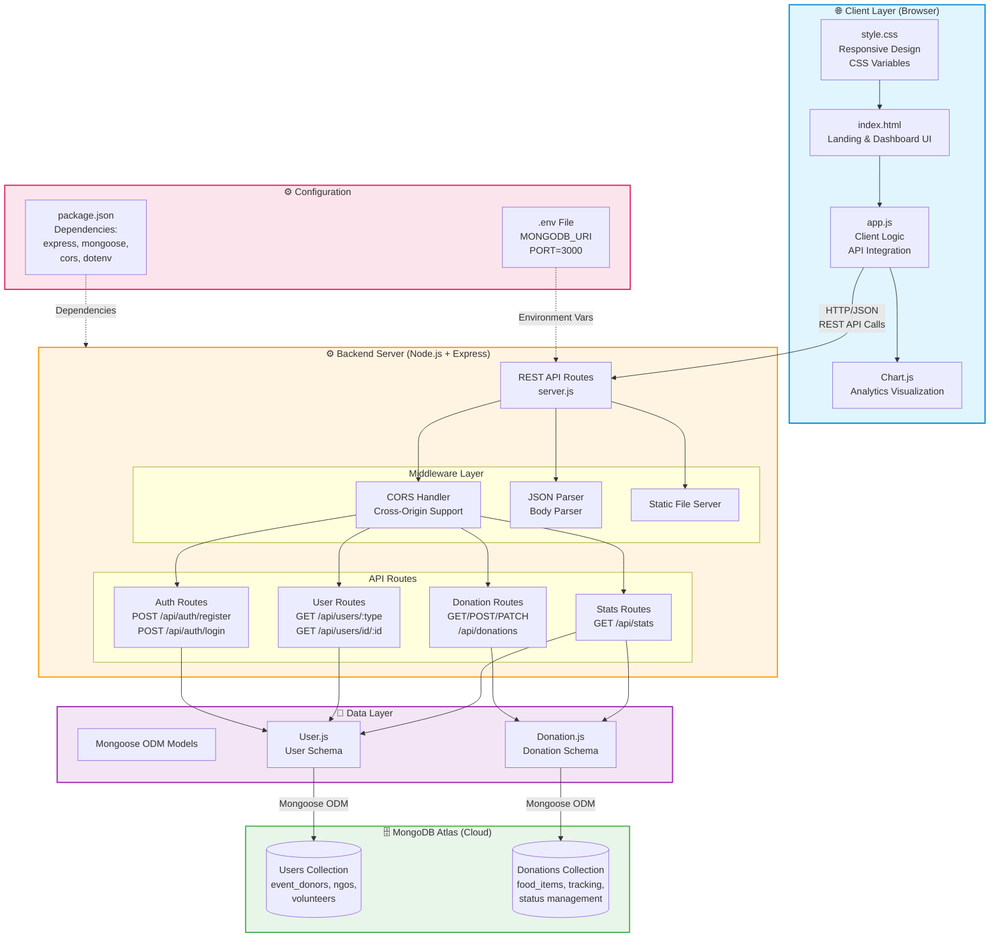

# System Architecture Diagram

This diagram shows the complete system architecture of the Annadaan platform, including all technology layers and their interactions.

## Technology Stack Summary

### Frontend
- **HTML5** - Semantic markup with accessibility
- **CSS3** - Custom design system with CSS variables
- **Vanilla JavaScript (ES6+)** - No frameworks, lightweight
- **Chart.js** - Data visualization library

### Backend
- **Node.js v16+** - JavaScript runtime
- **Express.js v4.18.2** - Web framework
- **Mongoose v8.0.0** - MongoDB ODM
- **CORS v2.8.5** - Cross-origin resource sharing
- **dotenv v16.3.1** - Environment configuration

### Database
- **MongoDB Atlas** - Cloud-hosted NoSQL database
- **Collections**: Users, Donations
- **Indexing**: Email (unique), Tracking ID (unique)

### Development Tools
- **Nodemon v3.0.1** - Auto-restart development server
- **npm** - Package management
- **Git** - Version control

## Communication Flow

1. **User Request**: Browser sends HTTP request to Express server
2. **Middleware Processing**: CORS, JSON parsing, authentication
3. **Route Handling**: Appropriate route handler processes request
4. **Data Access**: Mongoose models interact with MongoDB
5. **Response**: JSON data sent back to client
6. **UI Update**: JavaScript updates DOM dynamically
