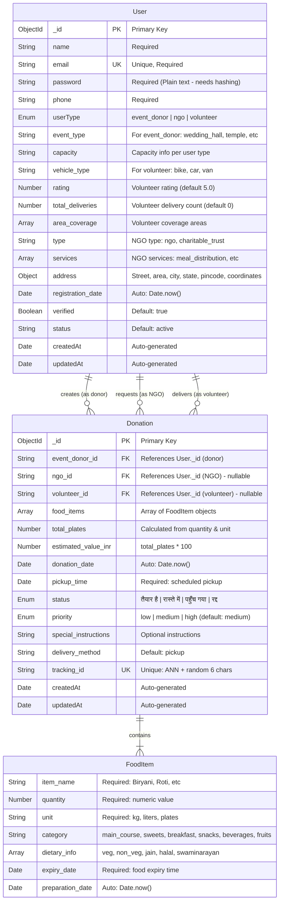

# Entity Relationship Diagram (ERD)

This diagram shows the complete database schema with all entities, attributes, and relationships.



## Schema Details

### User Schema (models/User.js)

**User Types:**
1. **event_donor** - Wedding halls, temples, caterers, corporate events
2. **ngo** - NGOs, charitable trusts, food banks
3. **volunteer** - Community delivery partners

**Type-Specific Fields:**

| User Type | Specific Fields |
|-----------|----------------|
| event_donor | event_type, capacity |
| volunteer | vehicle_type, rating, total_deliveries, area_coverage |
| ngo | type, services |

**Address Object Structure:**
```javascript
{
  street: String,
  area: String,
  city: String,
  state: String,
  pincode: String,
  coordinates: [Number] // [longitude, latitude]
}
```

### Donation Schema (models/Donation.js)

**Status Values (Hindi + English):**
- `तैयार है` - Ready for pickup (available)
- `रास्ते में` - In transit (assigned to volunteer)
- `पहुँच गया` - Delivered (completed)
- `रद्द` - Cancelled

**Calculation Logic:**
```javascript
// Plates calculation based on unit
if (unit === 'kg') totalPlates = quantity * 4
if (unit === 'liters') totalPlates = quantity * 3
if (unit === 'plates') totalPlates = quantity
else totalPlates = quantity / 2

// Value calculation
estimated_value_inr = totalPlates * 100 (₹100 per plate)
```

**Food Categories:**
- main_course (Rice, Dal, Sabzi, Roti)
- sweets (Ladoo, Barfi, Halwa)
- breakfast (Poha, Upma, Idli)
- snacks (Samosa, Pakora)
- beverages (Chai, Lassi)
- fruits

**Dietary Info Tags:**
- veg (Vegetarian)
- non_veg (Non-vegetarian)
- jain (Jain dietary restrictions)
- halal (Halal certified)
- swaminarayan (Swaminarayan dietary rules)

### Relationships

1. **User → Donation (as event_donor)**
   - One event donor can create many donations
   - Field: `event_donor_id` in Donation

2. **User → Donation (as NGO)**
   - One NGO can request many donations
   - Field: `ngo_id` in Donation (nullable)

3. **User → Donation (as volunteer)**
   - One volunteer can deliver many donations
   - Field: `volunteer_id` in Donation (nullable)

### Indexes

**Unique Indexes:**
- User.email (enforces unique user accounts)
- Donation.tracking_id (enforces unique tracking IDs)

**Query Optimization Potential:**
- Index on Donation.status (frequently filtered)
- Index on Donation.event_donor_id (donor queries)
- Index on Donation.ngo_id (NGO queries)
- Index on Donation.volunteer_id (volunteer queries)

## Data Flow Example

1. **Event Donor creates donation**:
   ```
   event_donor_id: "507f1f77bcf86cd799439011"
   ngo_id: null
   volunteer_id: null
   status: "तैयार है"
   ```

2. **NGO requests donation**:
   ```
   event_donor_id: "507f1f77bcf86cd799439011"
   ngo_id: "507f1f77bcf86cd799439012"
   volunteer_id: null
   status: "रास्ते में"
   ```

3. **Volunteer accepts pickup**:
   ```
   event_donor_id: "507f1f77bcf86cd799439011"
   ngo_id: "507f1f77bcf86cd799439012"
   volunteer_id: "507f1f77bcf86cd799439013"
   status: "रास्ते में"
   ```

4. **Delivery completed**:
   ```
   event_donor_id: "507f1f77bcf86cd799439011"
   ngo_id: "507f1f77bcf86cd799439012"
   volunteer_id: "507f1f77bcf86cd799439013"
   status: "पहुँच गया"
   ```
