# User Flow Sequence Diagram

This diagram illustrates the complete donation lifecycle from creation to delivery, showing interactions between all actors and the system.

```mermaid
sequenceDiagram
    participant ED as 🏛️ Event Donor
    participant Client as 🌐 Browser (app.js)
    participant API as ⚙️ Express API (server.js)
    participant DB as 🗄️ MongoDB Atlas
    participant NGO as 🏢 NGO
    participant Vol as 🏍️ Volunteer

    %% Registration & Login Flow
    rect rgb(240, 248, 255)
        Note over ED,DB: Phase 1: Registration & Authentication
        ED->>Client: Fill registration form
        Client->>API: POST /api/auth/register
        API->>DB: Create User document
        DB-->>API: User created (verified: true)
        API-->>Client: Return user object
        Client-->>ED: Show dashboard with success notification
    end

    %% Donation Creation Flow
    rect rgb(255, 250, 240)
        Note over ED,DB: Phase 2: Donation Creation
        ED->>Client: Click "Create अन्नदान"
        Client->>ED: Show donation form modal
        ED->>Client: Fill form (food item, quantity, pickup time)
        Client->>API: POST /api/donations
        Note right of API: Calculate plates:<br/>kg: quantity * 4<br/>liters: quantity * 3<br/>plates: quantity
        API->>API: Generate tracking ID (ANN + 6 chars)
        API->>DB: Save Donation (status: "तैयार है")
        DB-->>API: Donation created with tracking ID
        API-->>Client: Return donation object
        Client-->>ED: Success notification + plate count
        Client->>Client: Refresh dashboard
    end

    %% NGO Discovery & Request Flow
    rect rgb(240, 255, 240)
        Note over NGO,DB: Phase 3: NGO Discovers & Requests Food
        NGO->>Client: Login to dashboard
        Client->>API: POST /api/auth/login
        API->>DB: Find user by email & password
        DB-->>API: Return NGO user
        API-->>Client: Login successful
        Client-->>NGO: Show NGO dashboard

        NGO->>Client: Click "Available अन्नदान"
        Client->>API: GET /api/donations?status=तैयार है
        API->>DB: Query donations (status: "तैयार है")
        DB-->>API: Return available donations
        API-->>Client: List of donations with donor info
        Client-->>NGO: Display table of available food

        NGO->>Client: Click "Request अन्नदान" button
        Client->>API: PATCH /api/donations/:id<br/>{ngo_id, status: "रास्ते में"}
        API->>DB: Update donation
        DB-->>API: Donation updated
        API-->>Client: Request confirmed
        Client-->>NGO: Success notification
        Client->>Client: Refresh available donations
    end

    %% Volunteer Pickup Flow
    rect rgb(255, 245, 255)
        Note over Vol,DB: Phase 4: Volunteer Accepts Delivery
        Vol->>Client: Login to volunteer dashboard
        Vol->>Client: Click "Available Pickups"
        Client->>API: GET /api/donations?status=रास्ते में
        API->>DB: Query donations needing volunteer
        DB-->>API: Return pickups
        API-->>Client: List with donor & NGO info
        Client-->>Vol: Display seva opportunities

        Vol->>Client: Click "Accept Seva" button
        Client->>API: PATCH /api/donations/:id<br/>{volunteer_id}
        API->>DB: Update donation with volunteer
        DB-->>API: Assignment confirmed
        API-->>Client: Pickup assigned
        Client-->>Vol: Success notification
        Client->>Client: Move to "My Deliveries"
    end

    %% Delivery Completion Flow
    rect rgb(255, 240, 245)
        Note over Vol,DB: Phase 5: Delivery Completion
        Vol->>Client: Pick up food from donor
        Vol->>Client: Transport to NGO
        Vol->>Client: Mark as delivered
        Client->>API: PATCH /api/donations/:id<br/>{status: "पहुँच गया"}
        API->>DB: Update donation status
        API->>DB: Increment volunteer.total_deliveries
        DB-->>API: Delivery recorded
        API-->>Client: Completion confirmed
        Client-->>Vol: Impact metrics updated
    end

    %% Analytics Flow
    rect rgb(250, 250, 250)
        Note over ED,Vol: Phase 6: Impact Analytics (All Users)
        ED->>Client: View "Impact Analytics"
        Client->>API: GET /api/stats
        API->>DB: Aggregate all donations
        Note right of API: Calculate:<br/>- Total donations<br/>- Plates served<br/>- Food saved (kg)<br/>- Value (INR)<br/>- People fed
        DB-->>API: Aggregated statistics
        API-->>Client: Return impact data
        Client->>Client: Render Chart.js visualizations
        Client-->>ED: Display charts & metrics
    end
```



## Flow Breakdown

### Phase 1: Registration & Authentication
**File**: `app.js` lines 119-156, `server.js` lines 28-72, 75-90

- User selects user type (event_donor, ngo, volunteer)
- Frontend collects type-specific fields
- Backend validates email uniqueness
- User document created with `verified: true`
- Session established (no JWT in current implementation)

### Phase 2: Donation Creation
**File**: `app.js` lines 937-984, `server.js` lines 155-210

**Input**: Food item name, quantity, unit, category, dietary info, expiry date, pickup time

**Processing**:
```javascript
// Plate calculation (server.js:173-179)
if (unit === 'plates') totalPlates = quantity
else if (unit === 'kg') totalPlates = quantity * 4
else if (unit === 'liters') totalPlates = quantity * 3
else totalPlates = quantity / 2

// Value calculation (server.js:196)
estimated_value_inr = totalPlates * 100

// Tracking ID generation (server.js:182)
tracking_id = 'ANN' + Math.random().toString(36).substr(2, 6).toUpperCase()
```

**Output**: Donation created with status "तैयार है" (Ready)

### Phase 3: NGO Food Request
**File**: `app.js` lines 523-539, 986-1009, `server.js` lines 213-237

- NGO views available donations (status: "तैयार है")
- Clicks "Request अन्नदान"
- Frontend sends PATCH with ngo_id and status update
- Status changes to "रास्ते में" (In Transit)
- Donation now visible to volunteers

### Phase 4: Volunteer Pickup Assignment
**File**: `app.js` lines 595-611, 1011-1034, `server.js` lines 213-237

- Volunteer browses donations where volunteer_id is null
- Accepts pickup ("Seva")
- volunteer_id assigned to donation
- Donation remains "रास्ते में" but now has full assignment chain

### Phase 5: Delivery Completion
**File**: `server.js` lines 213-237

- Volunteer marks delivery complete
- Status changes to "पहुँच गया" (Delivered)
- System updates volunteer.total_deliveries counter
- Impact metrics automatically updated

### Phase 6: Analytics & Impact Tracking
**File**: `app.js` lines 749-810, `server.js` lines 242-271

**Metrics Calculated**:
- Total donations count
- Plates served (sum of all total_plates)
- Food saved in kg (calculated from food_items)
- Total value in INR (plates × ₹100)
- People fed (same as plates served)
- Volunteers involved (count of volunteer users)

## API Endpoints Used

| Endpoint | Method | Purpose |
|----------|--------|---------|
| `/api/auth/register` | POST | User registration |
| `/api/auth/login` | POST | User authentication |
| `/api/donations` | GET | Fetch donations (with filters) |
| `/api/donations` | POST | Create new donation |
| `/api/donations/:id` | PATCH | Update donation (request, assign, complete) |
| `/api/stats` | GET | Platform-wide statistics |
| `/api/users/:userType` | GET | Fetch users by type |

## State Transitions

```
[Created] → तैयार है (Ready)
    ↓ NGO requests
रास्ते में (In Transit)
    ↓ Volunteer accepts
रास्ते में (In Transit) [with volunteer]
    ↓ Delivery complete
पहुँच गया (Delivered)
```

## Key Features Demonstrated

1. **No Authentication Tokens**: Simple email/password check (plain text - security risk)
2. **Status-Based Workflow**: Hindi status values guide the process
3. **Automatic Calculations**: Plates and value computed server-side
4. **Real-time Updates**: Frontend refreshes after each action
5. **Multi-Actor Coordination**: Three user types work together seamlessly
