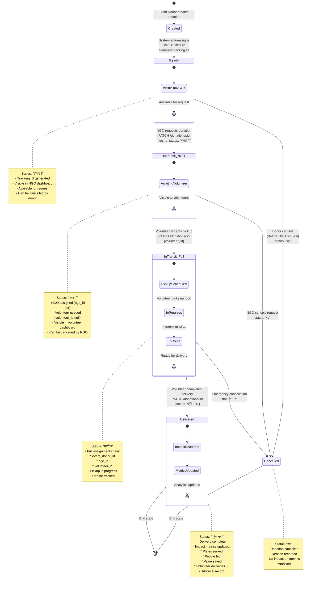

# Donation State Machine

This diagram shows all possible states of a donation and the transitions between them throughout the donation lifecycle.



## State Details

### State 1: Created (Initial)
**Duration**: Milliseconds
**System Actions**:
- Donation document created in MongoDB
- Automatic transition to "Ready"

**Database Fields**:
```javascript
{
  event_donor_id: ObjectId,
  ngo_id: null,
  volunteer_id: null,
  status: "तैयार है", // Auto-set
  tracking_id: "ANN" + random(6), // Generated
  total_plates: calculated,
  estimated_value_inr: calculated
}
```

**Code Reference**: `server.js:184-202`

---

### State 2: Ready (तैयार है)
**Duration**: Minutes to Hours
**Visibility**: NGO Dashboard → "Available अन्नदान"

**Characteristics**:
- ✅ Visible to all NGOs
- ✅ Searchable by food type, quantity
- ✅ Shows donor information
- ✅ Displays pickup time and expiry
- ❌ Not visible to volunteers yet

**Actions Available**:
- **NGO**: Request donation → Transition to InTransit_NGO
- **Donor**: Cancel donation → Transition to Cancelled

**Query Filter**:
```javascript
GET /api/donations?status=तैयार है
// Returns all donations where status === 'तैयार है' OR status === 'available'
```

**Code Reference**: `app.js:523-539`, `server.js:122-138`

---

### State 3: InTransit_NGO (रास्ते में - Awaiting Volunteer)
**Duration**: Minutes to Hours
**Visibility**: Volunteer Dashboard → "Available Pickups"

**Database State**:
```javascript
{
  event_donor_id: ObjectId,
  ngo_id: ObjectId, // ← Now assigned
  volunteer_id: null, // ← Still null
  status: "रास्ते में"
}
```

**Characteristics**:
- ✅ NGO has claimed the donation
- ✅ Visible to volunteers for pickup
- ✅ Shows full route: Donor → NGO
- ❌ No volunteer assigned yet

**Actions Available**:
- **Volunteer**: Accept pickup → Transition to InTransit_Full
- **NGO**: Cancel request → Transition to Cancelled

**Query Filter**:
```javascript
// For volunteers looking for pickups
GET /api/donations?status=रास्ते में
// Filter client-side: donations where volunteer_id === null
```

**Code Reference**: `app.js:595-611, 1011-1034`, `server.js:213-237`

---

### State 4: InTransit_Full (रास्ते में - Volunteer Assigned)
**Duration**: 30 minutes to 2 hours
**Visibility**: Volunteer Dashboard → "My Deliveries"

**Database State**:
```javascript
{
  event_donor_id: ObjectId,
  ngo_id: ObjectId,
  volunteer_id: ObjectId, // ← Now assigned
  status: "रास्ते में"
}
```

**Characteristics**:
- ✅ Full assignment chain complete
- ✅ Volunteer has pickup details
- ✅ Real-time tracking possible
- ✅ All parties notified

**Sub-States** (Logical, not in DB):
1. **Pickup Scheduled**: Volunteer accepted, heading to donor
2. **In Progress**: Food picked up from donor
3. **En Route**: Traveling to NGO location

**Actions Available**:
- **Volunteer**: Complete delivery → Transition to Delivered
- **System**: Emergency cancel → Transition to Cancelled (rare)

**Code Reference**: `app.js:613-628`, `server.js:213-237`

---

### State 5: Delivered (पहुँच गया)
**Duration**: Permanent (Historical Record)
**Visibility**: All dashboards in history/analytics

**System Actions on Entry**:
1. Update donation status to "पहुँच गया"
2. Increment `volunteer.total_deliveries`
3. Update platform-wide impact metrics
4. Record timestamp of delivery

**Impact Calculations**:
```javascript
// Aggregate calculations (server.js:242-271)
- total_donations++
- plates_served += donation.total_plates
- people_fed += donation.total_plates
- food_saved_kg += calculated_from_food_items
- value_inr += donation.estimated_value_inr
```

**Characteristics**:
- ✅ Immutable record
- ✅ Contributes to analytics
- ✅ Visible in all user histories
- ✅ Proof of impact

**Query Filter**:
```javascript
GET /api/donations?status=पहुँच गया
// Or filter by user:
GET /api/donations?event_donor_id=XXX&status=पहुँच गया
GET /api/donations?ngo_id=XXX
GET /api/donations?volunteer_id=XXX
```

**Code Reference**: `server.js:242-271`, `app.js:749-810`

---

### State 6: Cancelled (रद्द)
**Duration**: Permanent (Historical Record)
**Visibility**: Only in creator's history

**Possible Cancellation Points**:
1. **From Ready**: Donor cancels before NGO request
2. **From InTransit_NGO**: NGO cancels after requesting
3. **From InTransit_Full**: Emergency cancellation (rare)

**System Actions**:
- Update status to "रद्द"
- Record cancellation reason (optional)
- Notify affected parties
- **Do NOT** update impact metrics

**Characteristics**:
- ❌ No impact on statistics
- ✅ Visible in audit trail
- ✅ Historical record maintained
- ❌ Cannot be reactivated

**Code Reference**: `server.js:213-237` (PATCH endpoint)

---

## State Transition Matrix

| From State | To State | Trigger | Actor | API Call |
|------------|----------|---------|-------|----------|
| Created | Ready | Auto | System | Internal (POST) |
| Ready | InTransit_NGO | Request | NGO | PATCH {ngo_id, status} |
| InTransit_NGO | InTransit_Full | Accept | Volunteer | PATCH {volunteer_id} |
| InTransit_Full | Delivered | Complete | Volunteer | PATCH {status} |
| Ready | Cancelled | Cancel | Donor | PATCH {status: "रद्द"} |
| InTransit_NGO | Cancelled | Cancel | NGO | PATCH {status: "रद्द"} |
| InTransit_Full | Cancelled | Emergency | System/Admin | PATCH {status: "रद्द"} |

## Status Enum Values

```javascript
// From models/Donation.js:32-36
status: {
  type: String,
  default: 'तैयार है',
  enum: [
    'तैयार है',    // Ready (Hindi)
    'रास्ते में',   // In Transit (Hindi)
    'पहुँच गया',    // Delivered (Hindi)
    'रद्द',         // Cancelled (Hindi)
    'completed',    // Legacy English status
    'pending',      // Legacy English status
    'available'     // Legacy English status
  ]
}
```

## Current Implementation Notes

⚠️ **No explicit state validation**: System relies on frontend logic
⚠️ **No state history tracking**: Can't see state change timeline
⚠️ **No rollback mechanism**: State changes are immediate and final
✅ **Simple and functional**: Works well for MVP

## Potential Improvements

1. Add state history array to track all transitions
2. Implement validation middleware to prevent invalid transitions
3. Add timestamps for each state change
4. Include cancellation reasons
5. Add "expired" state for donations past expiry_date
6. Implement notification system for state changes
