# API Architecture Map

This diagram shows all REST API endpoints, their organization, request/response formats, and relationships.

```mermaid
graph TB
    subgraph Client["🌐 Client Application (app.js)"]
        Login[Login/Register Forms]
        Dashboard[Dashboard Views]
        DonationForm[Donation Creation Form]
        Actions[User Actions]
    end

    subgraph API["⚙️ Express REST API (server.js)"]
        direction TB

        subgraph Auth["🔐 Authentication Endpoints"]
            Register["POST /api/auth/register<br/>━━━━━━━━━━━━━━<br/>Body: name, email, password,<br/>phone, userType, type-specific fields<br/>━━━━━━━━━━━━━━<br/>Response: User object<br/>Status: 201 Created"]

            LoginEP["POST /api/auth/login<br/>━━━━━━━━━━━━━━<br/>Body: email, password<br/>━━━━━━━━━━━━━━<br/>Response: {success, user}<br/>Status: 200 OK"]
        end

        subgraph Users["👥 User Management Endpoints"]
            GetByType["GET /api/users/:userType<br/>━━━━━━━━━━━━━━<br/>Params: event_donor|ngo|volunteer<br/>━━━━━━━━━━━━━━<br/>Response: Array of users<br/>Status: 200 OK"]

            GetById["GET /api/users/id/:id<br/>━━━━━━━━━━━━━━<br/>Params: User ObjectId<br/>━━━━━━━━━━━━━━<br/>Response: User object<br/>Status: 200 OK"]
        end

        subgraph Donations["🍛 Donation Management Endpoints"]
            GetDonations["GET /api/donations<br/>━━━━━━━━━━━━━━<br/>Query: status, event_donor_id,<br/>ngo_id, volunteer_id (optional)<br/>━━━━━━━━━━━━━━<br/>Response: Array of donations<br/>Status: 200 OK"]

            GetOneDonation["GET /api/donations/:id<br/>━━━━━━━━━━━━━━<br/>Params: Donation ObjectId<br/>━━━━━━━━━━━━━━<br/>Response: Donation object<br/>Status: 200 OK"]

            CreateDonation["POST /api/donations<br/>━━━━━━━━━━━━━━<br/>Body: event_donor_id, item_name,<br/>quantity, unit, category,<br/>dietary_info, expiry_date,<br/>pickup_time, special_instructions<br/>━━━━━━━━━━━━━━<br/>Response: Donation with tracking_id<br/>Status: 201 Created"]

            UpdateDonation["PATCH /api/donations/:id<br/>━━━━━━━━━━━━━━<br/>Body: ngo_id, volunteer_id,<br/>status (optional)<br/>━━━━━━━━━━━━━━<br/>Response: Updated donation<br/>Status: 200 OK"]
        end

        subgraph Stats["📊 Statistics & Analytics Endpoints"]
            GetStats["GET /api/stats<br/>━━━━━━━━━━━━━━<br/>No parameters<br/>━━━━━━━━━━━━━━<br/>Response: Platform-wide metrics<br/>- total_donations<br/>- plates_served<br/>- value_inr<br/>- food_saved_kg<br/>- people_fed<br/>- volunteers_involved<br/>Status: 200 OK"]
        end

        subgraph Static["📄 Static File Serving"]
            ServeHTML["GET /<br/>━━━━━━━━━━━━━━<br/>Serves index.html<br/>Status: 200 OK"]
            ServeStatic["Static Middleware<br/>━━━━━━━━━━━━━━<br/>Serves CSS, JS, images<br/>from root directory"]
        end
    end

    subgraph DB["🗄️ MongoDB Atlas"]
        UsersCol[(Users Collection)]
        DonationsCol[(Donations Collection)]
    end

    %% Client to API connections
    Login --> Register
    Login --> LoginEP
    Dashboard --> GetByType
    Dashboard --> GetById
    Dashboard --> GetDonations
    Dashboard --> GetStats
    DonationForm --> CreateDonation
    Actions --> UpdateDonation

    %% API to Database connections
    Register --> UsersCol
    LoginEP --> UsersCol
    GetByType --> UsersCol
    GetById --> UsersCol
    CreateDonation --> DonationsCol
    GetDonations --> DonationsCol
    GetOneDonation --> DonationsCol
    UpdateDonation --> DonationsCol
    GetStats --> UsersCol
    GetStats --> DonationsCol

    %% Styling
    style Auth fill:#e3f2fd,stroke:#1976d2,stroke-width:2px
    style Users fill:#f3e5f5,stroke:#7b1fa2,stroke-width:2px
    style Donations fill:#fff3e0,stroke:#f57c00,stroke-width:2px
    style Stats fill:#e8f5e9,stroke:#388e3c,stroke-width:2px
    style Static fill:#fce4ec,stroke:#c2185b,stroke-width:2px
```



## API Endpoint Documentation

### 🔐 Authentication Endpoints

#### POST /api/auth/register
**Purpose**: Create new user account
**Location**: `server.js:28-72`

**Request Body**:
```json
{
  "name": "Maharaja Palace Wedding Hall",
  "email": "contact@maharajapalace.com",
  "password": "demo123",
  "phone": "+91-9876543210",
  "userType": "event_donor",
  "event_type": "wedding_hall",
  "vehicle": null,
  "org_type": null
}
```

**Response (201 Created)**:
```json
{
  "success": true,
  "user": {
    "_id": "507f1f77bcf86cd799439011",
    "name": "Maharaja Palace Wedding Hall",
    "email": "contact@maharajapalace.com",
    "userType": "event_donor",
    "event_type": "wedding_hall",
    "capacity": "500 guests",
    "verified": true,
    "status": "active",
    "registration_date": "2025-01-15T10:30:00.000Z",
    "createdAt": "2025-01-15T10:30:00.000Z",
    "updatedAt": "2025-01-15T10:30:00.000Z"
  }
}
```

**Error Response (400)**:
```json
{
  "error": "User with this email already exists"
}
```

**Business Logic**:
- Checks email uniqueness
- Sets `verified: true` automatically (no email verification)
- Adds type-specific fields based on userType
- Stores password in **plain text** (security issue)

---

#### POST /api/auth/login
**Purpose**: Authenticate user
**Location**: `server.js:75-90`

**Request Body**:
```json
{
  "email": "contact@maharajapalace.com",
  "password": "demo123"
}
```

**Response (200 OK)**:
```json
{
  "success": true,
  "user": {
    "_id": "507f1f77bcf86cd799439011",
    "name": "Maharaja Palace Wedding Hall",
    "email": "contact@maharajapalace.com",
    "userType": "event_donor",
    ...
  }
}
```

**Error Response (401)**:
```json
{
  "error": "Invalid email or password"
}
```

**Business Logic**:
- Simple email + password match query
- **No JWT tokens** - client stores user object
- **No session management** - stateless (except client-side)
- **No password hashing** - compares plain text

---

### 👥 User Management Endpoints

#### GET /api/users/:userType
**Purpose**: Fetch all users of specific type
**Location**: `server.js:95-103`

**Example Request**:
```
GET /api/users/ngo
GET /api/users/event_donor
GET /api/users/volunteer
```

**Response (200 OK)**:
```json
[
  {
    "_id": "507f1f77bcf86cd799439012",
    "name": "Akshaya Patra Foundation",
    "email": "help@akshayapatra.org",
    "userType": "ngo",
    "type": "charitable_trust",
    "services": ["meal_distribution"],
    "verified": true,
    ...
  },
  ...
]
```

**Use Cases**:
- NGO dashboard: Load event donors for display
- Volunteer dashboard: Load NGO destinations
- Available donations table: Show donor names

**Code Reference**: `app.js:230-240, 668-670, 709-714`

---

#### GET /api/users/id/:id
**Purpose**: Fetch single user by MongoDB ObjectId
**Location**: `server.js:106-117`

**Example Request**:
```
GET /api/users/id/507f1f77bcf86cd799439011
```

**Response (200 OK)**:
```json
{
  "_id": "507f1f77bcf86cd799439011",
  "name": "Maharaja Palace Wedding Hall",
  "email": "contact@maharajapalace.com",
  ...
}
```

**Error Response (404)**:
```json
{
  "error": "User not found"
}
```

---

### 🍛 Donation Management Endpoints

#### GET /api/donations
**Purpose**: Fetch donations with optional filters
**Location**: `server.js:122-138`

**Query Parameters** (all optional):
- `status`: Filter by status (तैयार है, रास्ते में, पहुँच गया, रद्द)
- `event_donor_id`: Filter by donor
- `ngo_id`: Filter by NGO
- `volunteer_id`: Filter by volunteer

**Example Requests**:
```
GET /api/donations
GET /api/donations?status=तैयार है
GET /api/donations?event_donor_id=507f1f77bcf86cd799439011
GET /api/donations?ngo_id=507f1f77bcf86cd799439012&status=पहुँच गया
```

**Response (200 OK)**:
```json
[
  {
    "_id": "507f191e810c19729de860ea",
    "event_donor_id": "507f1f77bcf86cd799439011",
    "ngo_id": "507f1f77bcf86cd799439012",
    "volunteer_id": null,
    "food_items": [
      {
        "item_name": "Vegetable Biryani",
        "quantity": 35,
        "unit": "kg",
        "category": "main_course",
        "dietary_info": ["veg"],
        "expiry_date": "2025-01-15T20:00:00.000Z",
        "preparation_date": "2025-01-15T10:00:00.000Z"
      }
    ],
    "total_plates": 140,
    "estimated_value_inr": 14000,
    "donation_date": "2025-01-15T10:00:00.000Z",
    "pickup_time": "2025-01-15T14:00:00.000Z",
    "status": "रास्ते में",
    "priority": "medium",
    "special_instructions": "Keep warm, handle with care",
    "delivery_method": "pickup",
    "tracking_id": "ANN5K2J3X",
    "createdAt": "2025-01-15T10:00:00.000Z",
    "updatedAt": "2025-01-15T12:30:00.000Z"
  }
]
```

**Sorting**: Most recent first (`sort({ createdAt: -1 })`)

**Code Reference**: `app.js:242-253, 419, 489, 543, 615`

---

#### GET /api/donations/:id
**Purpose**: Fetch single donation by ID
**Location**: `server.js:141-152`

**Example Request**:
```
GET /api/donations/507f191e810c19729de860ea
```

**Response**: Same as single donation object above

---

#### POST /api/donations
**Purpose**: Create new donation
**Location**: `server.js:155-210`

**Request Body**:
```json
{
  "event_donor_id": "507f1f77bcf86cd799439011",
  "item_name": "Vegetable Biryani",
  "quantity": 35,
  "unit": "kg",
  "category": "main_course",
  "dietary_info": ["veg"],
  "expiry_date": "2025-01-15T20:00:00.000Z",
  "pickup_time": "2025-01-15T14:00:00.000Z",
  "special_instructions": "Keep warm"
}
```

**Processing Logic**:
```javascript
// Plate calculation (server.js:173-179)
if (unit === 'plates') totalPlates = quantity
else if (unit === 'kg') totalPlates = quantity * 4
else if (unit === 'liters') totalPlates = quantity * 3
else totalPlates = quantity / 2

// Value = ₹100 per plate
estimated_value_inr = totalPlates * 100

// Generate tracking ID
tracking_id = 'ANN' + Math.random().toString(36).substr(2, 6).toUpperCase()
// Example: ANN5K2J3X, ANNX8T9WQ

// Auto-set status
status = 'तैयार है' (Ready)
```

**Response (201 Created)**:
```json
{
  "success": true,
  "donation": {
    "_id": "507f191e810c19729de860ea",
    "tracking_id": "ANN5K2J3X",
    "total_plates": 140,
    "estimated_value_inr": 14000,
    "status": "तैयार है",
    ...
  }
}
```

**Code Reference**: `app.js:937-984`

---

#### PATCH /api/donations/:id
**Purpose**: Update donation (request, assign, complete)
**Location**: `server.js:213-237`

**Use Cases**:

1. **NGO Requests Donation**:
```json
PATCH /api/donations/507f191e810c19729de860ea
{
  "ngo_id": "507f1f77bcf86cd799439012",
  "status": "रास्ते में"
}
```

2. **Volunteer Accepts Pickup**:
```json
PATCH /api/donations/507f191e810c19729de860ea
{
  "volunteer_id": "507f1f77bcf86cd799439013"
}
```

3. **Mark as Delivered**:
```json
PATCH /api/donations/507f191e810c19729de860ea
{
  "status": "पहुँच गया"
}
```

**Response (200 OK)**:
```json
{
  "success": true,
  "donation": {
    "_id": "507f191e810c19729de860ea",
    "ngo_id": "507f1f77bcf86cd799439012",
    "volunteer_id": "507f1f77bcf86cd799439013",
    "status": "पहुँच गया",
    ...
  }
}
```

**Error Response (404)**:
```json
{
  "error": "Donation not found"
}
```

**Code Reference**: `app.js:986-1034`

---

### 📊 Statistics & Analytics Endpoint

#### GET /api/stats
**Purpose**: Get platform-wide impact metrics
**Location**: `server.js:242-271`

**Request**:
```
GET /api/stats
```

**Response (200 OK)**:
```json
{
  "total_donations": 1523,
  "plates_served": 45680,
  "value_inr": 4568000,
  "food_saved_kg": 11420,
  "fuel_saved_liters": 450,
  "people_fed": 45680,
  "volunteers_involved": 87
}
```

**Calculation Logic**:
```javascript
// Aggregate all donations
total_donations = Donation.countDocuments()
plates_served = sum(donations.total_plates)
value_inr = sum(donations.estimated_value_inr)

// Food saved calculation
for each donation:
  if unit === 'kg': food_saved_kg += quantity
  if unit === 'plates': food_saved_kg += quantity * 0.25
  else: food_saved_kg += quantity

people_fed = plates_served // 1 plate = 1 person
volunteers_involved = User.countDocuments({userType: 'volunteer'})
fuel_saved_liters = 450 // Hardcoded constant
```

**Code Reference**: `app.js:749-810, 256-265`

---

### 📄 Static File Serving

#### GET /
**Purpose**: Serve main HTML page
**Location**: `server.js:274-276`

**Response**: `index.html` file

---

#### Static Middleware
**Purpose**: Serve CSS, JS, images, and other static assets
**Location**: `server.js:16`

**Configuration**:
```javascript
app.use(express.static('.')) // Serves from root directory
```

**Served Files**:
- `/style.css`
- `/app.js`
- `/indian_*.json` (seed data files)
- Images, fonts, etc.

---

## API Call Patterns in Frontend

### Dashboard Data Loading Pattern
```javascript
// app.js:267-291
async function renderDashboard() {
  await fetchStats() // GET /api/stats

  if (userType === 'event_donor') {
    const donations = await fetchDonations({ event_donor_id: currentUser._id })
    // GET /api/donations?event_donor_id=XXX
  }
  else if (userType === 'ngo') {
    const donations = await fetchDonations()
    // GET /api/donations
  }
  else if (userType === 'volunteer') {
    const donations = await fetchDonations()
    // GET /api/donations
  }
}
```

### User Action Pattern
```javascript
// NGO requests donation (app.js:986-1009)
async function requestDonation(donationId) {
  await fetch(`${API_BASE_URL}/donations/${donationId}`, {
    method: 'PATCH',
    body: JSON.stringify({
      ngo_id: currentUser._id,
      status: 'रास्ते में'
    })
  })
  await renderAvailableDonations() // Refresh list
}
```

## Middleware Stack

```
Request → CORS → JSON Parser → Route Handler → Response
          ↓
      Static Files
```

**Configured Middleware** (`server.js:14-16`):
```javascript
app.use(cors()) // Allow all origins (development)
app.use(express.json()) // Parse JSON bodies
app.use(express.static('.')) // Serve static files
```

## Security Considerations

⚠️ **Current Issues**:
1. No authentication tokens (JWT)
2. No authorization checks (anyone can update any donation)
3. Passwords stored in plain text
4. CORS allows all origins
5. No rate limiting
6. No input sanitization

✅ **Good Practices**:
1. RESTful endpoint design
2. Proper HTTP methods (GET, POST, PATCH)
3. Consistent JSON responses
4. Error handling with try-catch

## Base URL Configuration

**Development**: `http://localhost:3000/api`
**Configured In**: `app.js:5`

```javascript
const API_BASE_URL = 'http://localhost:3000/api';
```
