# User Type Interaction Diagram

This diagram shows how the three user types (Event Donors, NGOs, and Volunteers) interact with each other and the platform to complete the food donation cycle.

```mermaid
graph TB
    subgraph EventDonors["🏛️ Event Donors"]
        ED1[Wedding Halls]
        ED2[Temples & Religious Centers]
        ED3[Corporate Event Venues]
        ED4[Catering Services]
        ED5[Community Centers]
    end

    subgraph NGOs["🏢 NGOs & Charitable Organizations"]
        NGO1[Food Banks]
        NGO2[Homeless Shelters]
        NGO3[Orphanages]
        NGO4[Old Age Homes]
        NGO5[Meal Distribution NGOs]
    end

    subgraph Volunteers["🏍️ Volunteers"]
        VOL1[Two-Wheeler Riders]
        VOL2[Car Owners]
        VOL3[Van/Truck Drivers]
        VOL4[Community Volunteers]
    end

    subgraph Platform["🌐 Annadaan Platform"]
        direction TB

        DonationCreation["Donation Creation<br/>━━━━━━━━━━<br/>• Food item details<br/>• Quantity & plates<br/>• Pickup time<br/>• Expiry date<br/>• Tracking ID"]

        AvailableFood["Available अन्नदान<br/>━━━━━━━━━━<br/>• Browse donations<br/>• Filter by type<br/>• View donor info<br/>• Check expiry"]

        PickupAssignment["Pickup Assignment<br/>━━━━━━━━━━<br/>• Route details<br/>• Donor location<br/>• NGO destination<br/>• Food quantity"]

        Delivery["Delivery & Tracking<br/>━━━━━━━━━━<br/>• Status updates<br/>• Real-time tracking<br/>• Completion confirm<br/>• Impact recording"]

        Analytics["Impact Analytics<br/>━━━━━━━━━━<br/>• Plates served<br/>• People fed<br/>• Food saved (kg)<br/>• Value saved (₹)<br/>• Carbon impact"]
    end

    subgraph Beneficiaries["❤️ End Beneficiaries"]
        BEN1[Homeless Individuals]
        BEN2[Underprivileged Children]
        BEN3[Elderly in Need]
        BEN4[Daily Wage Workers]
        BEN5[Disaster-Affected People]
    end

    %% Event Donors to Platform
    ED1 --> DonationCreation
    ED2 --> DonationCreation
    ED3 --> DonationCreation
    ED4 --> DonationCreation
    ED5 --> DonationCreation

    %% Platform to NGOs
    DonationCreation -->|Status: तैयार है<br/>Visible to NGOs| AvailableFood
    AvailableFood --> NGO1
    AvailableFood --> NGO2
    AvailableFood --> NGO3
    AvailableFood --> NGO4
    AvailableFood --> NGO5

    %% NGOs request donations
    NGO1 -->|Request अन्नदान<br/>Status: रास्ते में| PickupAssignment
    NGO2 -->|Request अन्नदान<br/>Status: रास्ते में| PickupAssignment
    NGO3 -->|Request अन्नदान<br/>Status: रास्ते में| PickupAssignment
    NGO4 -->|Request अन्नदान<br/>Status: रास्ते में| PickupAssignment
    NGO5 -->|Request अन्नदान<br/>Status: रास्ते में| PickupAssignment

    %% Platform to Volunteers
    PickupAssignment --> VOL1
    PickupAssignment --> VOL2
    PickupAssignment --> VOL3
    PickupAssignment --> VOL4

    %% Volunteers complete delivery
    VOL1 -->|Accept Seva<br/>Pickup & Deliver| Delivery
    VOL2 -->|Accept Seva<br/>Pickup & Deliver| Delivery
    VOL3 -->|Accept Seva<br/>Pickup & Deliver| Delivery
    VOL4 -->|Accept Seva<br/>Pickup & Deliver| Delivery

    %% Delivery to NGOs
    Delivery -->|Status: पहुँच गया<br/>Food Delivered| NGO1
    Delivery -->|Status: पहुँच गया<br/>Food Delivered| NGO2
    Delivery -->|Status: पहुँच गया<br/>Food Delivered| NGO3
    Delivery -->|Status: पहुँच गया<br/>Food Delivered| NGO4
    Delivery -->|Status: पहुँच गया<br/>Food Delivered| NGO5

    %% NGOs to Beneficiaries
    NGO1 -.->|Distribute Food| BEN1
    NGO2 -.->|Distribute Food| BEN2
    NGO3 -.->|Distribute Food| BEN3
    NGO4 -.->|Distribute Food| BEN4
    NGO5 -.->|Distribute Food| BEN5

    %% Analytics feedback loop
    Delivery --> Analytics
    Analytics -.->|Impact Dashboard| ED1
    Analytics -.->|Impact Dashboard| NGO1
    Analytics -.->|Impact Dashboard| VOL1

    %% Styling
    style EventDonors fill:#fff3e0,stroke:#f57c00,stroke-width:3px
    style NGOs fill:#e8f5e9,stroke:#388e3c,stroke-width:3px
    style Volunteers fill:#e3f2fd,stroke:#1976d2,stroke-width:3px
    style Platform fill:#f3e5f5,stroke:#7b1fa2,stroke-width:3px
    style Beneficiaries fill:#ffebee,stroke:#c62828,stroke-width:3px

    style DonationCreation fill:#fff9c4,stroke:#f9a825
    style AvailableFood fill:#c8e6c9,stroke:#43a047
    style PickupAssignment fill:#bbdefb,stroke:#1e88e5
    style Delivery fill:#ce93d8,stroke:#8e24aa
    style Analytics fill:#ffccbc,stroke:#ff5722
```



## User Type Profiles

### 🏛️ Event Donors (event_donor)

**Database Field**: `userType: "event_donor"`

**Types** (`event_type` field):
- `wedding_hall` - Wedding venues (e.g., Maharaja Palace)
- `temple` - Religious centers with langar/prasad
- `corporate` - Corporate event venues
- `catering` - Catering services
- `community_center` - Social gathering places

**Typical Surplus Food Sources**:
- Post-wedding banquet leftovers
- Daily temple prasad and langar
- Corporate event buffets
- Festival celebrations
- Community gatherings

**Platform Actions**:
1. **Create Donation** (`POST /api/donations`)
   - Input food details
   - Set quantity and pickup time
   - Add special instructions
   - Get tracking ID

2. **Track Donations** (`GET /api/donations?event_donor_id=XXX`)
   - View all created donations
   - Monitor status changes
   - See NGO assignments

3. **View Impact** (`GET /api/stats`)
   - Total plates donated
   - People fed
   - Food value saved
   - Personal impact metrics

**Dashboard Views** (`app.js:298-302`):
- Overview (stats cards)
- My अन्नदान (donation list)
- Create अन्नदान (donation form)
- Impact Analytics (charts)

**Demo Account**:
```
Email: contact@maharajapalace.com
Password: demo123
Type: wedding_hall
```

---

### 🏢 NGOs & Charitable Organizations (ngo)

**Database Field**: `userType: "ngo"`

**Types** (`type` field):
- `ngo` - Registered NGOs
- `charitable_trust` - Trusts (e.g., Akshaya Patra)
- `food_bank` - Food banks
- `shelter` - Homeless shelters

**Services** (`services` array):
- `meal_distribution` - Daily meal programs
- `food_bank` - Food storage and distribution
- `emergency_relief` - Disaster response
- `community_kitchen` - Community kitchens

**Platform Actions**:
1. **Browse Available Food** (`GET /api/donations?status=तैयार है`)
   - View all ready donations
   - Check food type and quantity
   - See donor location
   - Verify expiry time

2. **Request Donation** (`PATCH /api/donations/:id`)
   - Claim available food
   - Status changes to "रास्ते में"
   - Volunteer pickup triggered

3. **Receive Food**
   - Wait for volunteer delivery
   - Confirm receipt
   - Distribute to beneficiaries

4. **Track Impact** (`GET /api/stats`)
   - Total food received
   - Beneficiaries fed
   - Received donation history

**Dashboard Views** (`app.js:306-310`):
- Overview (stats cards)
- Available अन्नदान (browse food)
- Received Food (history)
- Impact Analytics (charts)

**Demo Account**:
```
Email: help@akshayapatra.org
Password: demo123
Type: charitable_trust
```

---

### 🏍️ Volunteers (volunteer)

**Database Field**: `userType: "volunteer"`

**Vehicle Types** (`vehicle_type` field):
- `bike` - Two-wheelers (quick, small quantities)
- `car` - Cars (medium capacity)
- `van` - Vans/trucks (large quantities)
- `on_foot` - Walking (very local)

**Profile Fields**:
- `rating`: Community rating (0-5 stars, default 5.0)
- `total_deliveries`: Number of completed deliveries
- `area_coverage`: Array of areas volunteer covers

**Motivation**:
- Community service (Seva)
- Social responsibility
- Building reputation
- Flexible participation

**Platform Actions**:
1. **Browse Pickups** (`GET /api/donations?status=रास्ते में`)
   - View available pickups (NGO requested, no volunteer)
   - Check route: Donor → NGO
   - See food quantity
   - View pickup time

2. **Accept Seva** (`PATCH /api/donations/:id`)
   - Accept pickup assignment
   - volunteer_id assigned
   - Receive donor and NGO details

3. **Complete Delivery** (`PATCH /api/donations/:id`)
   - Mark delivery complete
   - Status changes to "पहुँच गया"
   - `total_deliveries++`
   - Impact metrics updated

4. **Track Personal Impact** (`GET /api/stats`)
   - Deliveries completed
   - Plates delivered
   - People fed
   - Rating from NGOs

**Dashboard Views** (`app.js:312-316`):
- Overview (stats cards)
- Available Pickups (seva opportunities)
- My Deliveries (active & completed)
- My Impact (personal analytics)

**Demo Account**:
```
Email: rajesh.volunteer@gmail.com
Password: demo123
Vehicle: bike
```

---

## Interaction Patterns

### Pattern 1: Complete Donation Cycle

```
1. Event Donor creates donation
   ↓
2. Status: "तैयार है" (Ready)
   ↓
3. NGO browses and requests
   ↓
4. Status: "रास्ते में" (In Transit)
   ↓
5. Volunteer accepts pickup
   ↓
6. Volunteer picks up from donor
   ↓
7. Volunteer delivers to NGO
   ↓
8. Volunteer marks complete
   ↓
9. Status: "पहुँच गया" (Delivered)
   ↓
10. NGO distributes to beneficiaries
```

**Code Flow**:
- Step 1: `app.js:937-984` → `server.js:155-210`
- Step 3: `app.js:986-1009` → `server.js:213-237`
- Step 5: `app.js:1011-1034` → `server.js:213-237`
- Step 8: `server.js:213-237`

---

### Pattern 2: Multi-Party Visibility

**When Donation Status = "तैयार है"**:
- ✅ Visible to: All NGOs
- ❌ Hidden from: Volunteers (no pickup needed yet)
- 📊 Shows: Donor info, food details, pickup time

**When Donation Status = "रास्ते में" (NGO assigned, no volunteer)**:
- ✅ Visible to: All Volunteers
- ✅ Visible to: Assigned NGO
- ✅ Visible to: Original Event Donor
- 📊 Shows: Full route (Donor → NGO)

**When Donation Status = "रास्ते में" (Full assignment)**:
- ✅ Visible to: Assigned Volunteer (in "My Deliveries")
- ✅ Visible to: Assigned NGO (tracking)
- ✅ Visible to: Original Donor (tracking)

**When Donation Status = "पहुँच गया"**:
- ✅ Visible to: All parties in history
- 📊 Contributes to: Platform analytics

**Code Reference**: `app.js:523-539, 595-611`

---

### Pattern 3: Information Flow

**Event Donor sees**:
- Their created donations
- NGO that requested
- Volunteer assigned
- Current status
- Impact metrics

**NGO sees**:
- All available donations (ready status)
- Their requested donations (in transit)
- Donor information
- Volunteer assignment
- Delivery status

**Volunteer sees**:
- Available pickups (NGO requested, no volunteer)
- Donor location and details
- NGO destination
- Food quantity
- Their completed deliveries

**Code Reference**:
- Event Donor: `app.js:417-466, 468-484`
- NGO: `app.js:487-521, 523-556`
- Volunteer: `app.js:559-593, 595-628`

---

## Communication Channels

### Direct Interactions (Not in current system)
Currently, there are **no direct communication features** between users:
- ❌ No messaging system
- ❌ No phone call integration
- ❌ No real-time notifications
- ❌ No email alerts

### Indirect Coordination (Via Platform)
Users coordinate through **status changes and data visibility**:
1. Donor creates → NGOs see availability
2. NGO requests → Volunteers see pickup need
3. Volunteer accepts → All parties see assignment
4. Status updates → All parties track progress

**Potential Improvement**: Add phone numbers visibility for coordination

---

## Role-Based Access Control (Current Implementation)

### What Each User Type Can Access:

| Action | Event Donor | NGO | Volunteer |
|--------|-------------|-----|-----------|
| Create Donation | ✅ | ❌ | ❌ |
| View Available Donations | ❌ | ✅ | ❌ |
| Request Donation | ❌ | ✅ | ❌ |
| View Pickups | ❌ | ❌ | ✅ |
| Accept Pickup | ❌ | ❌ | ✅ |
| Mark Delivered | ❌ | ❌ | ✅ |
| View Own Donations | ✅ | ✅ | ✅ |
| View Platform Stats | ✅ | ✅ | ✅ |

**Implementation**: Client-side logic (`app.js:293-328`)

⚠️ **Security Note**: No server-side authorization checks! Anyone can call any API endpoint.

---

## User Journey Examples

### Journey 1: Wedding Hall Donation
```
Maharaja Palace (Event Donor)
↓ Creates donation: 50kg Biryani
↓ Status: तैयार है
Akshaya Patra (NGO)
↓ Requests donation
↓ Status: रास्ते में
Rajesh (Volunteer)
↓ Accepts pickup, delivers food
↓ Status: पहुँच गया
Akshaya Patra
↓ Distributes to 200 beneficiaries
Impact recorded in analytics
```

### Journey 2: Temple Prasad Donation
```
Golden Temple Kitchen (Event Donor)
↓ Creates: Daily langar surplus
↓ Status: तैयार है
Local Shelter (NGO)
↓ Requests daily pickup
↓ Status: रास्ते में
Regular Volunteer
↓ Daily delivery route
↓ Status: पहुँच गया
Shelter residents fed
Daily impact tracking
```

---

## Impact Tracking Across User Types

### Event Donor Impact
- Total donations created
- Total plates donated
- Total value (₹) donated
- People fed (cumulative)

### NGO Impact
- Total donations received
- Total plates distributed
- Beneficiaries served
- Food categories received

### Volunteer Impact
- Total deliveries completed
- Total plates transported
- Total distance covered (not tracked yet)
- Community rating

### Platform-Wide Impact
- Aggregates all user contributions
- Shows collective social impact
- Visualized in analytics dashboard

**Code Reference**: `server.js:242-271`, `app.js:749-810`
