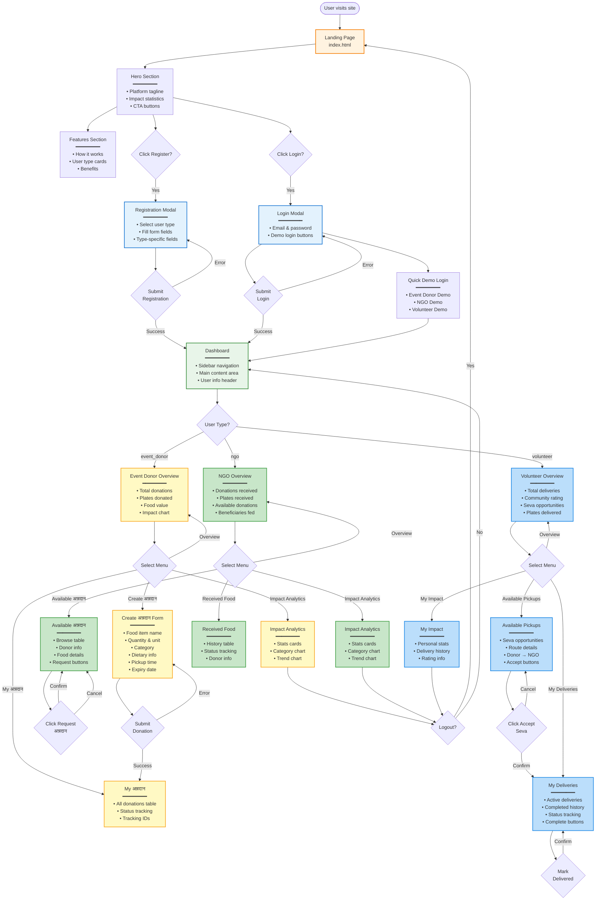

# Frontend Navigation Flowchart

This diagram shows the complete user interface navigation flow, including landing pages, dashboards, and all user interactions.



## Page Structure

### Landing Page (index.html)
**File**: `index.html`, `app.js:67-73`

**Sections**:
1. **Navigation Bar**
   - Logo: "अन्नदान"
   - Register button → Opens registration modal
   - Login button → Opens login modal

2. **Hero Section**
   - Headline: "अन्नदान महादान - The Greatest Gift is Food"
   - Tagline: Platform description
   - Statistics cards (loaded from API)
   - CTA: "Get Started" → Registration

3. **Features Section** (id: `features-section`)
   - How It Works cards
   - User type benefits
   - Process flow visualization

**JavaScript Functions**:
- `showLanding()` - Display landing, hide dashboard
- `showRegister()` - Open registration modal
- `showLogin()` - Open login modal

---

## Dashboard Layout

### Common Dashboard Structure
**File**: `app.js:75-83`

**Components**:
```
┌─────────────────────────────────────────┐
│  Header: User Name | Logout             │
├──────────┬──────────────────────────────┤
│          │                              │
│ Sidebar  │  Main Content Area           │
│ Menu     │  (Dynamic based on view)     │
│          │                              │
│          │                              │
│          │                              │
└──────────┴──────────────────────────────┘
```

**HTML Structure**:
```html
<div id="dashboard-section">
  <div class="sidebar">
    <div id="sidebar-menu"></div>
  </div>
  <div class="dashboard-content">
    <div id="dashboard-title"></div>
    <div id="dashboard-actions"></div>
    <div id="dashboard-content"></div>
  </div>
</div>
```

**Code Reference**: `app.js:267-291`

---

## Navigation Menus

### Event Donor Menu
**Code**: `app.js:298-302`

```javascript
menuItems = [
  { id: 'overview', icon: 'fa-chart-line', label: 'Overview' },
  { id: 'donations', icon: 'fa-hands', label: 'My अन्नदान' },
  { id: 'create-donation', icon: 'fa-plus', label: 'Create अन्नदान' },
  { id: 'analytics', icon: 'fa-chart-bar', label: 'Impact Analytics' }
]
```

**View Handlers**:
- `overview` → `renderEventDonorOverview()` (app.js:417-466)
- `donations` → `renderEventDonorDonations()` (app.js:468-484)
- `create-donation` → `showCreateDonation()` (app.js:933-935)
- `analytics` → `renderAnalytics()` (app.js:749-810)

---

### NGO Menu
**Code**: `app.js:306-310`

```javascript
menuItems = [
  { id: 'overview', icon: 'fa-chart-line', label: 'Overview' },
  { id: 'available-donations', icon: 'fa-list', label: 'Available अन्नदान' },
  { id: 'received-donations', icon: 'fa-box', label: 'Received Food' },
  { id: 'analytics', icon: 'fa-chart-bar', label: 'Impact Analytics' }
]
```

**View Handlers**:
- `overview` → `renderNgoOverview()` (app.js:487-521)
- `available-donations` → `renderAvailableDonations()` (app.js:523-539)
- `received-donations` → `renderReceivedDonations()` (app.js:541-556)
- `analytics` → `renderAnalytics()` (app.js:749-810)

---

### Volunteer Menu
**Code**: `app.js:312-316`

```javascript
menuItems = [
  { id: 'overview', icon: 'fa-chart-line', label: 'Overview' },
  { id: 'available-pickups', icon: 'fa-motorcycle', label: 'Available Pickups' },
  { id: 'my-deliveries', icon: 'fa-route', label: 'My Deliveries' },
  { id: 'analytics', icon: 'fa-chart-bar', label: 'My Impact' }
]
```

**View Handlers**:
- `overview` → `renderVolunteerOverview()` (app.js:559-593)
- `available-pickups` → `renderAvailablePickups()` (app.js:595-611)
- `my-deliveries` → `renderMyDeliveries()` (app.js:613-628)
- `analytics` → `renderAnalytics()` (app.js:749-810)

---

## Modal Windows

### Registration Modal
**ID**: `register-modal`
**Trigger**: Click "Register" button
**Code**: `app.js:85-88, 119-156`

**Components**:
1. **User Type Selection** (Radio buttons)
   - Event Donor
   - NGO
   - Volunteer
   - Changes visible fields dynamically

2. **Common Fields**:
   - Name
   - Email
   - Password
   - Phone

3. **Type-Specific Fields**:
   - **Event Donor**: Event type dropdown
   - **NGO**: Organization type
   - **Volunteer**: Vehicle type

**Form Submission**:
```javascript
handleRegistration(e) {
  → POST /api/auth/register
  → If success: Hide modal, show dashboard
  → If error: Show error notification
}
```

**Code Reference**: `app.js:119-156`

---

### Login Modal
**ID**: `login-modal`
**Trigger**: Click "Login" button
**Code**: `app.js:89-91, 158-185`

**Components**:
1. **Login Form**:
   - Email input
   - Password input
   - Submit button

2. **Quick Demo Login** (Below form):
   - "Event Donor Demo" button
   - "NGO Demo" button
   - "Volunteer Demo" button

**Demo Login Credentials**:
```javascript
// app.js:188-192
demo_credentials = {
  event_donor: { email: 'contact@maharajapalace.com', password: 'demo123' },
  ngo: { email: 'help@akshayapatra.org', password: 'demo123' },
  volunteer: { email: 'rajesh.volunteer@gmail.com', password: 'demo123' }
}
```

**Form Submission**:
```javascript
handleLogin(e) {
  → POST /api/auth/login
  → If success: Hide modal, show dashboard
  → If error: Show error notification
}
```

**Code Reference**: `app.js:158-221`

---

### Donation Creation Modal
**ID**: `donation-modal`
**Trigger**: Click "Create अन्नदान" (Event Donors only)
**Code**: `app.js:933-935, 937-984`

**Form Fields**:
```javascript
{
  item_name: text,          // Food item name
  quantity: number,         // Numeric quantity
  unit: select,             // kg, liters, plates, pieces
  category: select,         // main_course, sweets, breakfast, etc.
  dietary_info: checkboxes, // veg, non_veg, jain, halal
  expiry_date: datetime,    // When food expires
  pickup_time: datetime,    // Scheduled pickup
  instructions: textarea    // Special instructions
}
```

**Processing**:
```javascript
handleDonationCreation(e) {
  → Collect form data
  → Calculate dietary_info array from checkboxes
  → POST /api/donations
  → Server calculates plates & value
  → If success: Show notification, refresh dashboard
  → If error: Show error message
}
```

**Code Reference**: `app.js:937-984`

---

## View Rendering Functions

### Stats Cards Component
**Used in**: All overview pages

**Structure**:
```html
<div class="stats-grid">
  <div class="stat-card">
    <div class="stat-value">1,234</div>
    <div class="stat-label">Metric Name</div>
  </div>
  <!-- More cards -->
</div>
```

**Data Source**:
- Personal: Filtered donations
- Platform: `GET /api/stats`

---

### Donations Table Component
**Used in**: All donation list views

**Function**: `renderDonationsTable(donations)` (app.js:631-660)

**Columns**:
1. Food Item
2. Quantity & Plates
3. Pickup Time
4. Status (with color badge)
5. Tracking ID

**Status Badges**:
- `तैयार है` → Yellow (warning)
- `रास्ते में` → Blue (info)
- `पहुँच गया` → Green (success)
- `रद्द` → Red (error)

---

### Available Donations Table (NGO)
**Function**: `renderAvailableDonationsTable(donations)` (app.js:662-701)

**Columns**:
1. Event Donor (name fetched from API)
2. Food Item
3. Quantity
4. Pickup Time
5. Expiry Date
6. Action Button ("Request अन्नदान")

**Button Action**:
```javascript
onclick="requestDonation('${donation._id}')"
→ PATCH /api/donations/:id
→ Updates ngo_id and status
→ Refreshes table
```

---

### Available Pickups Table (Volunteer)
**Function**: `renderAvailablePickupsTable(pickups)` (app.js:703-746)

**Columns**:
1. Event Donor
2. Food Item
3. Quantity
4. Pickup Time
5. NGO Destination
6. Action Button ("Accept Seva")

**Button Action**:
```javascript
onclick="acceptPickup('${pickup._id}')"
→ PATCH /api/donations/:id
→ Updates volunteer_id
→ Moves to "My Deliveries"
```

---

### Analytics Charts
**Function**: `renderAnalytics()` (app.js:749-810)

**Components**:
1. **Stats Cards** (6 cards)
   - Total अन्नदान
   - Plates Served
   - Food Saved (kg)
   - Food Value (₹)
   - Fuel Saved (L)
   - People Fed

2. **Category Doughnut Chart** (app.js:854-884)
   - Food categories distribution
   - Chart.js doughnut chart
   - Legend at bottom

3. **Trend Line Chart** (app.js:886-930)
   - Monthly donation trends
   - People fed over time
   - Dual line chart

**Chart Library**: Chart.js (CDN loaded)

---

## Navigation Flow Control

### View Switching
**Function**: `switchDashboardView(viewId)` (app.js:357-414)

**Process**:
1. Update active sidebar link styling
2. Determine current user type
3. Call appropriate render function
4. Update main content area

**Example**:
```javascript
// User clicks "My अन्नदान"
switchDashboardView('donations')
→ Checks userType === 'event_donor'
→ Calls renderEventDonorDonations()
→ Fetches GET /api/donations?event_donor_id=XXX
→ Renders donations table
```

---

### Dashboard Actions
**Function**: `renderDashboardActions(userType)` (app.js:330-354)

**Buttons Rendered**:

**Event Donor**:
- "Create अन्नदान" → Opens donation modal
- "View City Map" → Opens map modal (placeholder)

**NGO**:
- "Browse अन्नदान" → Switches to available-donations view
- "View City Map" → Opens map modal (placeholder)

**Volunteer**:
- "Find Seva Opportunities" → Switches to available-pickups view
- "View City Map" → Opens map modal (placeholder)

---

## Notifications System

### Notification Function
**Function**: `showNotification(message, type)` (app.js:1063-1108)

**Types**:
- `success` - Green border (successful actions)
- `error` - Red border (failures)
- `warning` - Yellow border (warnings)
- `info` - Blue border (information)

**Behavior**:
- Fixed position: Top-right corner
- Auto-dismiss: 5 seconds
- Manual close: Click X button
- Slide-in animation

**Usage Examples**:
```javascript
showNotification('अन्नदान created successfully!', 'success')
showNotification('Invalid email or password', 'error')
showNotification('Logged out successfully', 'info')
```

---

## State Management

### Global State Variables
**File**: `app.js:7-18`

```javascript
let currentUser = null          // Logged-in user object
let currentView = 'landing'     // Current page view
let cachedUsers = {             // Cached user data
  event_donor: [],
  ngo: [],
  volunteer: []
}
let cachedDonations = []        // Cached donation data
let impactStats = {}            // Platform statistics
```

**State Updates**:
- Login: Sets `currentUser`, changes `currentView` to 'dashboard'
- Logout: Resets `currentUser` to null, changes to 'landing'
- Data fetching: Updates cached arrays
- Navigation: Updates `currentView` (not consistently used)

---

## Responsive Design Notes

**CSS File**: `style.css`

**Breakpoints** (inferred from typical responsive design):
- Mobile: < 768px
- Tablet: 768px - 1024px
- Desktop: > 1024px

**Dashboard Layout**:
- Desktop: Sidebar + Content (side-by-side)
- Mobile: Sidebar collapses, hamburger menu

**Tables**:
- Desktop: Full table display
- Mobile: Horizontal scroll or card layout

---

## URL Routing

### Current Implementation
**No URL routing** - Single Page Application (SPA)

All navigation handled by JavaScript:
- No browser history entries
- No shareable URLs for views
- No back button support

**Potential Improvement**: Implement hash routing (#/dashboard/overview)

---

## Keyboard Navigation

**Current Support**:
- Tab: Navigate through form fields
- Enter: Submit forms
- Escape: Close modals (not implemented)

**Missing**:
- Keyboard shortcuts for common actions
- Arrow key navigation in tables
- Focus management in modals

---

## Accessibility Considerations

✅ **Implemented**:
- Semantic HTML tags
- Font Awesome icons with labels
- Color contrast (needs verification)

❌ **Missing**:
- ARIA labels
- Screen reader support
- Keyboard-only navigation
- Focus indicators
- Alt text for images

---

## Performance Optimizations

**Current Optimizations**:
- Chart rendering delayed with `setTimeout()`
- Cached user data to reduce API calls
- Sorting on server (`sort({ createdAt: -1 })`)

**Potential Improvements**:
- Lazy loading for tables
- Pagination for large datasets
- Image optimization
- Code splitting
- Service worker for offline support
