# Data Flow Diagram

This diagram illustrates how data flows through the Annadaan system from user input to database storage and back to visualization.

```mermaid
graph LR
    subgraph Inputs["📥 Data Inputs"]
        UserReg[User Registration<br/>━━━━━━━<br/>name, email, password,<br/>phone, userType,<br/>type-specific fields]

        DonationInput[Donation Creation<br/>━━━━━━━<br/>item_name, quantity,<br/>unit, category,<br/>dietary_info, expiry_date,<br/>pickup_time]

        ActionInput[User Actions<br/>━━━━━━━<br/>Request donation,<br/>Accept pickup,<br/>Mark delivered]
    end

    subgraph Frontend["🌐 Frontend Layer (app.js)"]
        Forms[Form Collection<br/>━━━━━━━<br/>• Validation<br/>• Formatting<br/>• Serialization]

        StateManagement[State Management<br/>━━━━━━━<br/>• currentUser<br/>• cachedUsers<br/>• cachedDonations<br/>• impactStats]

        UIRendering[UI Rendering<br/>━━━━━━━<br/>• Table generation<br/>• Chart rendering<br/>• Dashboard views]
    end

    subgraph API["⚙️ API Layer (server.js)"]
        Routes[Route Handlers<br/>━━━━━━━<br/>• Auth routes<br/>• User routes<br/>• Donation routes<br/>• Stats routes]

        BusinessLogic[Business Logic<br/>━━━━━━━<br/>• Plate calculation<br/>• Value calculation<br/>• Tracking ID generation<br/>• Aggregations]

        Validation[Data Validation<br/>━━━━━━━<br/>• Email uniqueness<br/>• Required fields<br/>• Enum values]
    end

    subgraph DataAccess["🔄 Data Access Layer"]
        Mongoose[Mongoose ODM<br/>━━━━━━━<br/>• Schema validation<br/>• Query building<br/>• Type casting<br/>• Timestamps]
    end

    subgraph Database["🗄️ Database (MongoDB Atlas)"]
        UsersColl[(Users Collection<br/>━━━━━━━<br/>Indexed: email)]
        DonationsColl[(Donations Collection<br/>━━━━━━━<br/>Indexed: tracking_id)]
    end

    subgraph Outputs["📤 Data Outputs"]
        DashboardData[Dashboard Views<br/>━━━━━━━<br/>• Stats cards<br/>• Donation tables<br/>• User lists]

        AnalyticsData[Analytics<br/>━━━━━━━<br/>• Chart data<br/>• Impact metrics<br/>• Trends]

        Notifications[Notifications<br/>━━━━━━━<br/>• Success messages<br/>• Error alerts<br/>• Status updates]
    end

    %% Input Flow
    UserReg --> Forms
    DonationInput --> Forms
    ActionInput --> Forms

    Forms --> StateManagement
    StateManagement --> Routes

    %% API Processing
    Routes --> Validation
    Validation --> BusinessLogic
    BusinessLogic --> Mongoose

    %% Database Operations
    Mongoose --> UsersColl
    Mongoose --> DonationsColl

    %% Output Flow
    UsersColl --> Mongoose
    DonationsColl --> Mongoose

    Mongoose --> Routes
    Routes --> StateManagement
    StateManagement --> UIRendering

    UIRendering --> DashboardData
    UIRendering --> AnalyticsData
    UIRendering --> Notifications

    %% Styling
    style Inputs fill:#fff3e0,stroke:#f57c00,stroke-width:2px
    style Frontend fill:#e3f2fd,stroke:#1976d2,stroke-width:2px
    style API fill:#fff4e1,stroke:#ff9800,stroke-width:2px
    style DataAccess fill:#f3e5f5,stroke:#7b1fa2,stroke-width:2px
    style Database fill:#e8f5e9,stroke:#4caf50,stroke-width:2px
    style Outputs fill:#fce4ec,stroke:#e91e63,stroke-width:2px
```



## Detailed Data Flow Scenarios

### Flow 1: User Registration Data Flow


**Data Transformations**:

1. **Form Data → JavaScript Object**
   ```javascript
   // app.js:121-133
   const formData = new FormData(e.target)
   const userData = {
     name: formData.get('name'),
     email: formData.get('email'),
     password: formData.get('password'),
     phone: formData.get('phone'),
     userType: document.querySelector('.user-type-btn.active').dataset.type,
     // Type-specific fields added based on userType
   }
   ```

2. **API → MongoDB Document**
   ```javascript
   // server.js:39-62
   const userData = {
     name, email, password, phone, userType,
     verified: true,
     status: 'active'
   }
   // Add type-specific fields
   if (userType === 'event_donor') {
     userData.event_type = event_type
     userData.capacity = '500 guests'
   }
   // ...
   const user = new User(userData)
   await user.save() // MongoDB inserts with _id, timestamps
   ```

3. **MongoDB → Response**
   ```javascript
   // server.js:67
   res.status(201).json({ success: true, user })
   // user includes: _id, createdAt, updatedAt (auto-generated)
   ```

---

### Flow 2: Donation Creation Data Flow

```mermaid
sequenceDiagram
    participant Form as Donation Form
    participant FE as Frontend (app.js)
    participant API as API Routes
    participant BL as Business Logic
    participant DB as MongoDB

    Form->>FE: User submits donation
    Note over Form: item_name, quantity,<br/>unit, category, etc.

    FE->>FE: Collect form data
    Note over FE: handleDonationCreation()<br/>lines 937-984

    FE->>FE: Process dietary checkboxes
    Note over FE: Build dietary_info array

    FE->>API: POST /api/donations
    Note over FE,API: JSON: {event_donor_id,<br/>item_name, quantity,<br/>unit, category, ...}

    API->>BL: Calculate plates
    Note over BL: Based on unit:<br/>kg: qty * 4<br/>liters: qty * 3<br/>plates: qty

    BL->>BL: Calculate value
    Note over BL: plates * 100 INR

    BL->>BL: Generate tracking ID
    Note over BL: 'ANN' + random(6)

    BL->>API: Return calculated values
    Note over BL: totalPlates,<br/>estimatedValue,<br/>trackingId

    API->>DB: Insert donation
    Note over API: new Donation({<br/>...input,<br/>total_plates,<br/>estimated_value_inr,<br/>tracking_id,<br/>status: 'तैयार है'<br/>})

    DB-->>API: Donation created
    API-->>FE: 201 Created
    Note over API,FE: {success: true,<br/>donation: {...}}

    FE->>FE: Update UI
    FE-->>Form: Show success notification
    Note over FE: "140 plates worth<br/>₹14000 created"
```



**Data Transformations**:

1. **Form Dietary Checkboxes → Array**
   ```javascript
   // app.js:942-944
   const dietaryInfo = []
   document.querySelectorAll('input[name="dietary"]:checked').forEach(checkbox => {
     dietaryInfo.push(checkbox.value)
   })
   // Result: ['veg', 'jain'] or ['non_veg', 'halal']
   ```

2. **Quantity + Unit → Plates Calculation**
   ```javascript
   // server.js:170-179
   let totalPlates
   if (unit === 'plates') {
     totalPlates = quantity
   } else if (unit === 'kg') {
     totalPlates = Math.round(quantity * 4)  // 1 kg = 4 plates
   } else if (unit === 'liters') {
     totalPlates = Math.round(quantity * 3)  // 1 liter = 3 plates
   } else {
     totalPlates = Math.round(quantity / 2)
   }
   ```

3. **Tracking ID Generation**
   ```javascript
   // server.js:182
   const trackingId = 'ANN' + Math.random().toString(36).substr(2, 6).toUpperCase()
   // Examples: ANN5K2J3X, ANNX8T9WQ, ANN2F7HPN
   ```

4. **Food Item Object Construction**
   ```javascript
   // server.js:186-194
   food_items: [{
     item_name,
     quantity,
     unit,
     category,
     dietary_info: dietary_info || [],
     expiry_date,
     preparation_date: new Date()  // Auto-set to now
   }]
   ```

---

### Flow 3: Dashboard Data Loading Flow


**Data Aggregation Examples**:

1. **Platform Statistics** (`server.js:244-266`)
   ```javascript
   // Total donations
   const totalDonations = await Donation.countDocuments()

   // Get all donations for aggregation
   const donations = await Donation.find()

   // Sum plates served
   const platesServed = donations.reduce((sum, d) => sum + d.total_plates, 0)

   // Sum value
   const valueInr = donations.reduce((sum, d) => sum + (d.estimated_value_inr || 0), 0)

   // Calculate food saved in kg
   const foodSavedKg = donations.reduce((sum, d) => {
     const firstItem = d.food_items[0]
     if (firstItem.unit === 'kg') return sum + firstItem.quantity
     if (firstItem.unit === 'plates') return sum + (firstItem.quantity * 0.25)
     return sum + firstItem.quantity
   }, 0)

   // Count volunteers
   const volunteerCount = await User.countDocuments({ userType: 'volunteer' })
   ```

2. **Filtered Queries** (`server.js:124-131`)
   ```javascript
   const { status, event_donor_id, ngo_id, volunteer_id } = req.query

   const filter = {}
   if (status) filter.status = status
   if (event_donor_id) filter.event_donor_id = event_donor_id
   if (ngo_id) filter.ngo_id = ngo_id
   if (volunteer_id) filter.volunteer_id = volunteer_id

   const donations = await Donation.find(filter).sort({ createdAt: -1 })
   ```

---

### Flow 4: Update Action Data Flow (NGO Requests Donation)

```mermaid
sequenceDiagram
    participant NGO as NGO User
    participant FE as Frontend
    participant API as API Server
    participant DB as MongoDB

    NGO->>FE: Click "Request अन्नदान"
    Note over NGO,FE: On available donation

    FE->>API: PATCH /api/donations/:id
    Note over FE,API: Body: {<br/>ngo_id: currentUser._id,<br/>status: 'रास्ते में'<br/>}

    API->>API: Build update object
    Note over API: updateData = {<br/>ngo_id,<br/>status<br/>}

    API->>DB: Update donation
    Note over API: Donation.findByIdAndUpdate(<br/>id,<br/>updateData,<br/>{new: true}<br/>)

    DB->>DB: Find document by _id
    DB->>DB: Apply updates
    DB->>DB: Update updatedAt timestamp

    DB-->>API: Updated donation
    Note over DB,API: Full donation object<br/>with new values

    API-->>FE: 200 OK
    Note over API,FE: {success: true,<br/>donation: {...}}

    FE->>FE: Refresh available donations
    Note over FE: Call renderAvailableDonations()

    FE->>API: GET /api/donations?status=तैयार है
    API->>DB: Query available donations
    DB-->>API: Updated list (without requested one)
    API-->>FE: JSON array

    FE->>FE: Render updated table
    FE-->>NGO: Show success notification
    Note over FE: "अन्नदान requested successfully!"
```



**Update Data Transformations**:

```javascript
// app.js:987-1009
async function requestDonation(donationId) {
  const response = await fetch(`${API_BASE_URL}/donations/${donationId}`, {
    method: 'PATCH',
    headers: { 'Content-Type': 'application/json' },
    body: JSON.stringify({
      ngo_id: currentUser._id,    // Assign NGO
      status: 'रास्ते में'          // Change status
    })
  })

  if (response.ok) {
    await renderAvailableDonations()  // Refresh view
  }
}
```

```javascript
// server.js:214-237
app.patch('/api/donations/:id', async (req, res) => {
  const { ngo_id, volunteer_id, status } = req.body

  // Build update object (only provided fields)
  const updateData = {}
  if (ngo_id !== undefined) updateData.ngo_id = ngo_id
  if (volunteer_id !== undefined) updateData.volunteer_id = volunteer_id
  if (status) updateData.status = status

  // Mongoose automatically updates updatedAt
  const donation = await Donation.findByIdAndUpdate(
    req.params.id,
    updateData,
    { new: true }  // Return updated document
  )

  res.json({ success: true, donation })
})
```

---

### Flow 5: Analytics Chart Data Flow


**Chart Data Transformations**:

1. **Category Doughnut Chart** (`app.js:854-884`)
   ```javascript
   // Hardcoded data (should come from backend aggregation)
   const categoryData = {
     labels: [
       'Main Course (Rice, Dal, Sabzi)',
       'Sweets & Desserts',
       'Breakfast Items',
       'Snacks & Starters'
     ],
     datasets: [{
       data: [65, 20, 10, 5],  // Percentages
       backgroundColor: ['#FF6B35', '#FF9933', '#138808', '#FFD700']
     }]
   }

   new Chart(ctx, {
     type: 'doughnut',
     data: categoryData,
     options: { /* ... */ }
   })
   ```

2. **Trend Line Chart** (`app.js:886-930`)
   ```javascript
   // Hardcoded monthly data (should come from backend)
   const trendData = {
     labels: ['May', 'Jun', 'Jul', 'Aug', 'Sep', 'Oct'],
     datasets: [
       {
         label: 'अन्नदान Events',
         data: [12, 19, 15, 25, 22, 30],
         borderColor: '#FF6B35'
       },
       {
         label: 'People Fed',
         data: [1200, 1900, 1500, 2500, 2200, 3000],
         borderColor: '#138808'
       }
     ]
   }

   new Chart(ctx, {
     type: 'line',
     data: trendData,
     options: { /* ... */ }
   })
   ```

**Note**: Current implementation uses hardcoded chart data. Real implementation should:
```javascript
// Ideal backend endpoint
GET /api/analytics/categories
→ { categories: [{name, count, percentage}, ...] }

GET /api/analytics/trends?months=6
→ { months: ['Jan', 'Feb', ...], donations: [10, 15, ...], people: [1000, 1500, ...] }
```

---

## Data Caching Strategy

### Frontend Caching
**Variables**: `app.js:12-18`

```javascript
let cachedUsers = {
  event_donor: [],
  ngo: [],
  volunteer: []
}
let cachedDonations = []
let impactStats = {}
```

**Usage**:
1. **Fetch once, use multiple times**
   ```javascript
   // app.js:668-670
   if (cachedUsers.event_donor.length === 0) {
     await fetchUsers('event_donor')
   }
   // Now use cachedUsers.event_donor without re-fetching
   ```

2. **No cache invalidation** - Data may become stale
3. **No TTL (Time To Live)** - Cached forever until page refresh

**Improvement Needed**:
- Implement cache invalidation on updates
- Add TTL for automatic refresh
- Use localStorage for persistence

---

## Data Validation Layers

### Layer 1: Frontend Validation (Limited)
- HTML5 required attributes
- Input type validation (number, email, date)
- No custom validation logic currently

### Layer 2: API Validation
**Email Uniqueness** (`server.js:33-36`):
```javascript
const existingUser = await User.findOne({ email })
if (existingUser) {
  return res.status(400).json({ error: 'User with this email already exists' })
}
```

### Layer 3: Mongoose Schema Validation
**User Schema** (`models/User.js`):
```javascript
{
  name: { type: String, required: true },
  email: { type: String, required: true, unique: true },
  password: { type: String, required: true },
  phone: { type: String, required: true },
  userType: {
    type: String,
    required: true,
    enum: ['event_donor', 'ngo', 'volunteer']
  },
  // ...
}
```

**Donation Schema** (`models/Donation.js`):
```javascript
{
  food_items: [{
    item_name: { type: String, required: true },
    quantity: { type: Number, required: true },
    unit: { type: String, required: true },
    // ...
  }],
  status: {
    type: String,
    default: 'तैयार है',
    enum: ['तैयार है', 'रास्ते में', 'पहुँच गया', 'रद्द', 'completed', 'pending', 'available']
  },
  tracking_id: { type: String, required: true, unique: true }
}
```

### Layer 4: MongoDB Validation
- Unique indexes enforced
- Data type enforcement
- Required field checks

---

## Data Format Examples

### User Document
```json
{
  "_id": "507f1f77bcf86cd799439011",
  "name": "Maharaja Palace Wedding Hall",
  "email": "contact@maharajapalace.com",
  "password": "demo123",
  "phone": "+91-9876543210",
  "userType": "event_donor",
  "event_type": "wedding_hall",
  "capacity": "500 guests",
  "verified": true,
  "status": "active",
  "registration_date": "2025-01-15T10:00:00.000Z",
  "createdAt": "2025-01-15T10:00:00.000Z",
  "updatedAt": "2025-01-15T10:00:00.000Z",
  "__v": 0
}
```

### Donation Document
```json
{
  "_id": "507f191e810c19729de860ea",
  "event_donor_id": "507f1f77bcf86cd799439011",
  "ngo_id": "507f1f77bcf86cd799439012",
  "volunteer_id": null,
  "food_items": [
    {
      "item_name": "Vegetable Biryani",
      "quantity": 35,
      "unit": "kg",
      "category": "main_course",
      "dietary_info": ["veg"],
      "expiry_date": "2025-01-15T20:00:00.000Z",
      "preparation_date": "2025-01-15T10:00:00.000Z",
      "_id": "507f191e810c19729de860eb"
    }
  ],
  "total_plates": 140,
  "estimated_value_inr": 14000,
  "donation_date": "2025-01-15T10:00:00.000Z",
  "pickup_time": "2025-01-15T14:00:00.000Z",
  "status": "रास्ते में",
  "priority": "medium",
  "special_instructions": "Keep warm, handle with care",
  "delivery_method": "pickup",
  "tracking_id": "ANN5K2J3X",
  "createdAt": "2025-01-15T10:00:00.000Z",
  "updatedAt": "2025-01-15T12:30:00.000Z",
  "__v": 0
}
```

### Stats Response
```json
{
  "total_donations": 1523,
  "plates_served": 45680,
  "value_inr": 4568000,
  "food_saved_kg": 11420,
  "fuel_saved_liters": 450,
  "people_fed": 45680,
  "volunteers_involved": 87
}
```

---

## Data Security Concerns

⚠️ **Critical Issues**:
1. **Passwords in plain text** - No hashing
2. **No input sanitization** - SQL/NoSQL injection risk
3. **No output encoding** - XSS vulnerabilities
4. **No authorization** - Anyone can update any data
5. **No rate limiting** - Abuse potential

✅ **Current Protections**:
1. CORS enabled (but allows all origins)
2. JSON body parsing (limits size)
3. Mongoose type casting
4. Unique constraints on email and tracking_id
